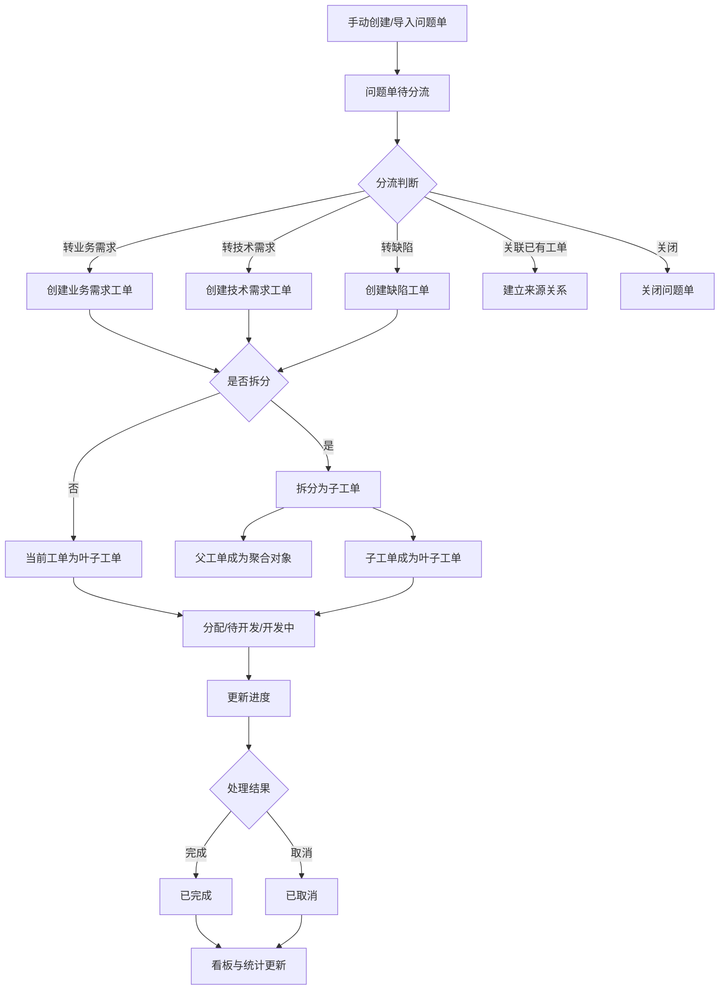
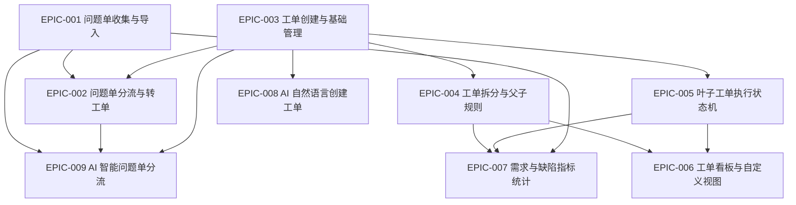

# PRD - 工单系统 V1.0

> 文档路径：`/Users/estelle/工作-中电2025/07-Workspace/08-projects/工单系统/PRD/PRD-工单系统-V1.0.md`
>
> 当前版本：V1.0
>
> 状态：精修稿
>
> 更新日期：2026-05-29

---

## 1. 概述

### 1.1 产品定位

工单系统是一个独立闭环的工单管理系统，用于承接需求线索和缺陷线索，完成问题单收集、问题单分流、工单创建、工单拆分、叶子工单执行、进度追踪、任务看板和指标统计。

系统当前阶段优先实现工单系统自身闭环，不与 GienCoder 智能软件工厂做深度联动。后续 P3 再考虑将叶子工单与 GienCoder 端到端研发流程打通。

### 1.2 背景

在产品研发与交付过程中，业务方、测试、运维、客服、产品经理、研发人员会持续产生需求线索和缺陷线索。这些线索来源分散、描述质量不一、优先级不清，进入研发流程前需要经过分流、判断、归类和转派。

传统问题收集与任务管理方式常见问题包括：

- 问题单、需求、缺陷和执行任务链路割裂。
- 问题来源难以追溯。
- 需求与缺陷的拆分、转派和进度汇总规则不清晰。
- 管理者难以从整体视角查看真实执行进度。
- 看板和列表视图不够灵活。
- 指标统计缺少统一口径。

因此，需要建设一个以工单为核心的系统，将需求线索、缺陷线索、业务需求、技术需求、缺陷、执行任务、进度看板和指标统计串联起来。

### 1.3 产品目标

1. 建立统一的问题线索入口，支持问题单手动创建、编辑、批量导入、查看和分流。
2. 建立统一的工单模型，支持业务需求、技术需求、缺陷三类工单。
3. 支持问题单转业务需求、技术需求、缺陷，也支持问题单关闭和关联已有工单。
4. 支持工单手动创建，并支持缺陷转业务需求或技术需求。
5. 支持工单最多二级拆分，明确父工单与子工单的职责边界。
6. 明确叶子工单是研发执行载体，父工单只做聚合、管理和追踪。
7. 支持叶子工单执行状态机：待分配、待开发、开发中、已完成、已取消。
8. 支持父工单状态和进度由子工单自动计算。
9. 支持个人视图、团队视图、列表、表格、泳道看板、自定义筛选、分组、排序。
10. 支持问题单、工单、需求、缺陷、进度、效率和负载指标统计。
11. P1 支持通过自然语言让 AI 创建业务需求、技术需求和缺陷工单。
12. P3 支持 AI 智能问题单分流和 GienCoder 联动。

### 1.4 核心价值

#### 对问题提交人

- 可以提交需求线索或缺陷线索。
- 可以追踪问题单是否被关闭、转工单或关联到已有工单。
- 可以查看问题单后续关联工单的处理状态。

#### 对分流处理人

- 可以集中处理待分流问题池。
- 可以将问题单转为业务需求、技术需求或缺陷。
- 可以关闭无效问题，也可以关联已有工单，减少重复创建。

#### 对产品经理

- 可以管理业务需求工单。
- 可以追溯业务需求来源于哪些问题单。
- 可以将大需求拆分为可执行的子工单。

#### 对技术负责人

- 可以管理技术需求工单。
- 可以将技术治理、性能优化、稳定性治理等工作纳入工单体系。
- 可以从业务需求或缺陷中派生技术需求。

#### 对测试 / 质量人员

- 可以创建和跟踪缺陷工单。
- 可以从问题单转缺陷。
- 可以将缺陷中暴露出的业务或技术问题转为需求。

#### 对研发执行人

- 可以明确处理分配给自己的叶子工单。
- 可以推进状态、更新进度和完成工单。
- 可以通过父工单和来源信息理解任务背景。

#### 对项目经理 / 管理者

- 可以查看团队工单进度和执行状态。
- 可以识别待分配积压、开发中负载、逾期风险和缺陷修复效率。
- 可以通过指标统计支撑周报、例会和管理决策。

### 1.5 范围定义

#### P0：独立闭环 MVP

- 问题单手动创建、编辑、批量导入、列表和详情。
- 问题单人工分流。
- 问题单转业务需求、技术需求、缺陷。
- 问题单关闭。
- 手动创建业务需求、技术需求、缺陷。
- 工单详情、编辑、来源追溯。
- 叶子工单分配、开始处理、进度更新、完成、取消。
- 工单列表视图、个人视图、团队视图基础能力。
- 基础指标统计、工单分类统计、状态分布统计。

#### P1：拆分、看板增强、AI 创建工单

- 问题单关联已有工单。
- 多问题单合并到同一工单。
- 一个问题单转多个工单。
- 工单二级拆分。
- 父工单状态和进度自动计算。
- 缺陷转业务需求或技术需求。
- 表格视图、泳道看板、自定义筛选、分组、排序。
- 个人视图转团队视图。
- AI 自然语言创建业务需求、技术需求和缺陷。
- AI 创建过程留痕。

#### P2：统计增强与协同增强

- 缺陷修复周期统计。
- 团队 / 负责人负载统计。
- 分流时长统计。
- 数据导出。
- AI 创建效果统计。
- 批量操作、操作审计、超期识别等增强能力。

#### P3：AI 智能分流与 GienCoder 联动

- AI 问题单分类建议。
- AI 工单分类建议。
- AI 优先级建议。
- AI 推荐负责人 / 团队。
- AI 相似问题和相似工单推荐。
- AI 分流建议采纳记录和效果统计。
- 叶子工单进入 GienCoder 开发任务。
- 需求工单进入 PRD / User Story 流程。
- 缺陷工单进入智能缺陷修复流程。

### 1.6 非目标

当前阶段不做：

- 不做完整 DevOps 平台。
- 不做无限层级 WBS。
- 不做复杂自定义状态流。
- 不做完整客服工单系统。
- 不做复杂审批流。
- 不在 P0/P1 打通 GienCoder。
- 不让 AI 未经人工确认自动创建、关闭或分流问题单。

---

## 2. 核心设计原则

1. Idea 不作为独立对象，统一理解为需求线索或缺陷线索。
2. 问题单是线索输入对象，不是研发执行对象。
3. 工单是统一管理对象，分类为业务需求、技术需求、缺陷。
4. 工单来源类型包括：问题单转入、人为创建、缺陷转需求、AI 创建。
5. 问题单与工单是 n:n 关系。
6. 工单最多支持二级结构：父工单、子工单。
7. 只有叶子工单作为研发执行载体。
8. 未拆分工单默认是叶子工单。
9. 已拆分父工单仅做聚合、管理和追踪。
10. 父工单状态和进度由子工单自动计算。
11. 父工单可在看板中作为关联项展示，但不作为筛选条件。
12. 视图分为个人视图和团队视图，个人视图支持转团队视图。
13. 当前阶段先实现工单独立闭环，GienCoder 联动放到 P3。

---

## 3. 用户画像

### 3.1 角色总览

| 角色 | 核心职责 | 主要模块 |
|---|---|---|
| 问题提交人 | 提交需求线索或缺陷线索 | 问题单创建、问题单查看 |
| 分流处理人 | 判断问题单处理方式 | 问题单分流、转工单、关闭 |
| 产品经理 | 管理业务需求 | 业务需求工单、拆分、看板、统计 |
| 技术负责人 / 架构师 | 管理技术需求 | 技术需求工单、拆分、技术统计 |
| 测试 / 质量人员 | 管理缺陷 | 缺陷工单、缺陷转需求、缺陷统计 |
| 研发执行人 | 处理叶子工单 | 我的工单、状态推进、进度更新 |
| 项目经理 / 管理者 | 管理进度与指标 | 看板、统计、负载、风险 |
| 系统管理员 | 系统配置与权限 | 用户、团队、角色、字典、权限 |

### 3.2 问题提交人

目标：快速提交问题线索，并追踪后续处理结果。

痛点：不知道问题应提交给谁；提交后缺少处理反馈；问题转为工单后难以追踪。

核心诉求：创建问题单、编辑问题单、查看问题单状态、查看关联工单。

### 3.3 分流处理人

目标：快速判断问题单应关闭、转业务需求、转技术需求、转缺陷，或关联已有工单。

痛点：问题描述质量不稳定；重复问题难识别；转派责任不清；来源关系容易丢失。

核心诉求：待分流问题池、分流动作、转工单、关闭、关联已有工单。

### 3.4 产品经理

目标：管理业务需求，追溯来源，拆分需求，跟踪进度。

核心诉求：业务需求创建、编辑、来源追溯、拆分、看板和统计。

### 3.5 技术负责人 / 架构师

目标：管理技术需求，包括架构、性能、稳定性、安全、工程效率等技术事项。

核心诉求：技术需求创建、拆分、缺陷转技术需求、技术需求看板和统计。

### 3.6 测试 / 质量人员

目标：创建和跟踪缺陷，并在缺陷暴露业务或技术问题时转为需求。

核心诉求：缺陷创建、缺陷分流、缺陷转需求、缺陷修复周期统计。

### 3.7 研发执行人

目标：处理叶子工单，推进状态和进度。

核心诉求：查看我的工单、开始处理、更新进度、完成、取消、查看父工单和来源背景。

### 3.8 项目经理 / 管理者

目标：查看整体进度、团队负载、风险和指标。

核心诉求：团队视图、泳道看板、统计报表、负载分析、转化率和周期统计。

### 3.9 系统管理员

目标：维护用户、团队、权限、字典和系统配置。

核心诉求：权限管理、字典配置、字段配置、统计口径配置、操作日志。

---

## 4. 业务实体设计

### 4.1 实体总览

| 实体 | 定义 |
|---|---|
| 问题单 | 需求线索或缺陷线索的输入对象 |
| 工单 | 业务需求、技术需求、缺陷的统一管理对象 |
| 工单来源关系 | 记录问题单、来源缺陷、AI 创建等来源信息 |
| 工单父子关系 | 记录最多二级拆分关系 |
| 状态日志 | 记录工单状态变更 |
| 进度日志 | 记录叶子工单进度变更 |
| 视图 | 保存个人或团队的筛选、分组、排序、字段配置 |
| 指标 | 基于问题单、工单和日志生成统计结果 |
| 用户 / 团队 | 权限、负责人、执行人和统计维度 |

### 4.2 问题单

问题单用于承载需求线索或缺陷线索，不进入工单执行状态机。

核心字段：

| 字段 | 说明 |
|---|---|
| 问题单编号 | 唯一编号 |
| 标题 | 问题摘要 |
| 描述 | 详细说明 |
| 线索类型 | 需求线索、缺陷线索、未知 |
| 状态 | 待分流、已转工单、已关闭 |
| 优先级 | P0、P1、P2、P3 |
| 分类 | 可配置问题分类 |
| 来源渠道 | 手动创建、批量导入、客服反馈、测试反馈等 |
| 提交人 | 问题提交人 |
| 影响范围 | 影响用户、模块、流程等 |
| 期望结果 | 期望表现 |
| 实际结果 | 实际表现 |
| 复现步骤 | 缺陷线索补充信息 |
| 附件 / 标签 | 辅助上下文 |
| 关闭原因 | 关闭时必填 |

状态：

```text
待分流 -> 已转工单
待分流 -> 已关闭
已关闭 -> 待分流
```

### 4.3 工单

工单是系统核心管理对象，分类为业务需求、技术需求、缺陷。

核心字段：

| 字段 | 说明 |
|---|---|
| 工单编号 | 唯一编号 |
| 标题 | 工单摘要 |
| 描述 | 工单详细说明 |
| 工单分类 | 业务需求、技术需求、缺陷 |
| 来源类型 | 问题单转入、人为创建、缺陷转需求、AI 创建 |
| 状态 | 待分配、待开发、开发中、已完成、已取消 |
| 进度 | 0-100 |
| 优先级 | P0、P1、P2、P3 |
| 负责人 | 工单责任人 |
| 执行人 / 团队 | 叶子工单执行主体 |
| 父工单 | 如有 |
| 子工单 | 如有 |
| 是否叶子工单 | 是否可执行 |
| 截止时间 | 计划完成时间 |
| 完成时间 | 实际完成时间 |
| 取消原因 | 取消时必填 |
| 来源问题单 | n:n 来源关系 |
| 来源缺陷 | 缺陷转需求场景 |
| AI 创建记录 | AI 创建场景 |

工单状态机：

```text
待分配 -> 待开发 -> 开发中 -> 已完成
待分配 / 待开发 / 开发中 -> 已取消
已完成 -> 待开发
已取消 -> 待分配 或 待开发
```

### 4.4 工单来源类型

| 来源类型 | 说明 |
|---|---|
| 问题单转入 | 由一个或多个问题单转化或关联生成 |
| 人为创建 | 用户通过表单手动创建 |
| 缺陷转需求 | 从缺陷工单派生业务需求或技术需求 |
| AI 创建 | 用户通过自然语言，经 AI 生成并确认后创建 |

### 4.5 工单拆分规则

| 规则 | 说明 |
|---|---|
| 最多二级 | 仅支持父工单和子工单 |
| 一级未拆分工单 | 默认是叶子工单，可执行 |
| 一级已拆分工单 | 父工单，只做聚合管理 |
| 二级子工单 | 必然是叶子工单，可执行 |
| 子工单 | 不可继续拆分 |
| 删除式拆分回退 | P0/P1 不支持 |

可拆分类型：

| 父工单分类 | 可拆分子工单分类 |
|---|---|
| 业务需求 | 业务需求、技术需求、缺陷 |
| 技术需求 | 技术需求、缺陷 |
| 缺陷 | 缺陷、业务需求、技术需求 |

### 4.6 父工单状态计算

父工单状态采用风险优先规则：

```text
全部取消 => 已取消
存在待分配 => 待分配
不存在待分配，存在待开发 => 待开发
不存在待分配/待开发，存在开发中 => 开发中
所有未取消子工单完成 => 已完成
```

### 4.7 父工单进度计算

默认等权平均：

```text
父工单进度 = 参与计算的子工单进度之和 / 参与计算的子工单数量
```

子工单参与规则：

| 子工单状态 | 参与计算 | 进度规则 |
|---|---|---|
| 待分配 | 是 | 0% |
| 待开发 | 是 | 0% |
| 开发中 | 是 | 1%-99%，执行人维护 |
| 已完成 | 是 | 100% |
| 已取消 | 否 | 不参与计算 |

全部子工单取消时，父工单状态为已取消，进度为 0%。

---

## 5. 业务流程

### 5.1 主流程



### 5.2 问题单创建与导入

- 手动创建问题单后，状态为待分流。
- 批量导入问题单后，每条成功记录创建为独立问题单，状态为待分流。
- 问题单创建或导入不会自动创建工单。

### 5.3 问题单分流

问题单待分流时，支持：

- 转业务需求。
- 转技术需求。
- 转缺陷。
- 关闭。
- P1 关联已有工单。
- P1 一个问题单转多个工单。
- P1 多问题单合并到同一工单。

### 5.4 手动创建工单

用户可手动创建业务需求、技术需求或缺陷工单。

初始状态规则：

| 创建时条件 | 初始状态 |
|---|---|
| 未指定执行人 / 团队 | 待分配 |
| 已指定执行人 / 团队 | 待开发 |

### 5.5 缺陷转需求

缺陷可转为业务需求或技术需求。

规则：

- 新工单来源类型为缺陷转需求。
- 新工单必须记录来源缺陷。
- 来源缺陷不自动关闭。
- 如果来源缺陷本身来自问题单，新需求可选择继承来源问题单关系。

### 5.6 叶子工单执行

只有叶子工单可以：

- 被分配。
- 开始处理。
- 更新进度。
- 完成。
- 取消。
- 重新打开。
- 重新启用。

父工单不允许手动推进状态和进度。

### 5.7 视图与看板

- 支持列表视图、表格视图、泳道看板。
- 支持个人视图和团队视图。
- 个人视图支持转团队视图。
- 父工单可作为关联项展示，但不作为筛选条件。
- 看板拖拽仅对叶子工单生效。

### 5.8 指标统计

统计对象包括：

- 问题单。
- 工单。
- 叶子工单。
- 父工单。
- 状态日志。
- 进度日志。
- 来源关系。

执行进展类指标优先以叶子工单为口径。

---

## 6. Epic 与 User Story 规划

### 6.1 Epic 总览

| Epic | 名称 | User Story 数量 | 阶段 |
|---|---|---:|---|
| EPIC-001 | 问题单收集与导入 | 6 | P0/P1 |
| EPIC-002 | 问题单分流与转工单 | 8 | P0/P1 |
| EPIC-003 | 工单创建与基础管理 | 8 | P0/P1 |
| EPIC-004 | 工单拆分与父子规则 | 6 | P1 |
| EPIC-005 | 叶子工单执行状态机 | 8 | P0/P1 |
| EPIC-006 | 工单看板与自定义视图 | 10 | P0/P1 |
| EPIC-007 | 需求与缺陷指标统计 | 10 | P0/P1/P2 |
| EPIC-008 | AI 自然语言创建工单 | 8 | P1/P2 |
| EPIC-009 | AI 智能问题单分流 | 8 | P3 |

### 6.2 依赖关系



---

## 7. User Story 清单

### EPIC-001 问题单收集与导入

| User Story | 名称 | 优先级 | 说明 |
|---|---|---|---|
| US-001-01 | 手动创建问题单 | P0 | 用户手动提交需求线索或缺陷线索 |
| US-001-02 | 编辑问题单 | P0 | 修改问题单基础信息 |
| US-001-03 | 批量导入问题单 | P0 | 从表格批量导入问题单 |
| US-001-04 | 查看问题单列表与详情 | P0 | 查看问题池和问题详情 |
| US-001-05 | 补充问题单信息 | P1 | 轻量占位，追加评论、附件、说明 |
| US-001-06 | 问题单重新打开 | P1 | 已关闭问题单回到待分流 |

### EPIC-002 问题单分流与转工单

| User Story | 名称 | 优先级 | 说明 |
|---|---|---|---|
| US-002-01 | 问题单人工分流 | P0 | 分流入口与动作集合 |
| US-002-02 | 问题单转业务需求 | P0 | 创建业务需求工单 |
| US-002-03 | 问题单转技术需求 | P0 | 创建技术需求工单 |
| US-002-04 | 问题单转缺陷 | P0 | 创建缺陷工单 |
| US-002-05 | 问题单关闭 | P0 | 关闭无需处理的问题单 |
| US-002-06 | 问题单关联已有工单 | P1 | 不新建工单，关联已有工单 |
| US-002-07 | 多问题单合并到同一工单 | P1 | 多个来源指向一个工单 |
| US-002-08 | 一个问题单转多个工单 | P1 | 一个复杂问题拆成多个工单 |

### EPIC-003 工单创建与基础管理

| User Story | 名称 | 优先级 | 说明 |
|---|---|---|---|
| US-003-01 | 手动创建业务需求工单 | P0 | 人工创建业务需求 |
| US-003-02 | 手动创建技术需求工单 | P0 | 人工创建技术需求 |
| US-003-03 | 手动创建缺陷工单 | P0 | 人工创建缺陷 |
| US-003-04 | 工单详情与编辑 | P0 | 查看和编辑统一工单 |
| US-003-05 | 工单来源追溯 | P0/P1 | 追溯问题单、缺陷、AI 来源 |
| US-003-06 | 缺陷转业务需求 / 技术需求 | P1 | 缺陷派生需求 |
| US-003-07 | 工单标签与附件 | P1 | 基础协作和上下文补充 |
| US-003-08 | 工单评论与备注 | P1 | 工单协作沟通 |

### EPIC-004 工单拆分与父子规则

| User Story | 名称 | 优先级 | 说明 |
|---|---|---|---|
| US-004-01 | 工单二级拆分 | P1 | 一级工单拆分为子工单 |
| US-004-02 | 限制子工单继续拆分 | P1 | 保证最多二级结构 |
| US-004-03 | 父工单状态自动计算 | P1 | 按风险优先规则计算父状态 |
| US-004-04 | 父工单进度自动计算 | P1 | 子工单进度等权平均 |
| US-004-05 | 父工单关联项展示 | P1 | 父工单可显示但不筛选 |
| US-004-06 | 子工单来源继承 | P1 | 拆分后来源可追溯 |

### EPIC-005 叶子工单执行状态机

| User Story | 名称 | 优先级 | 说明 |
|---|---|---|---|
| US-005-01 | 叶子工单分配 | P0 | 待分配进入待开发 |
| US-005-02 | 创建即进入待开发 | P0 | 创建时指定执行主体则待开发 |
| US-005-03 | 叶子工单开始处理 | P0 | 待开发进入开发中 |
| US-005-04 | 叶子工单进度更新 | P0 | 开发中维护 1%-99% |
| US-005-05 | 叶子工单完成 | P0 | 完成后进度 100% |
| US-005-06 | 叶子工单取消 | P0 | 取消后不参与父进度计算 |
| US-005-07 | 已完成工单重新打开 | P1 | 回到待开发 |
| US-005-08 | 已取消工单重新启用 | P1 | 回到待分配或待开发 |

### EPIC-006 工单看板与自定义视图

| User Story | 名称 | 优先级 | 说明 |
|---|---|---|---|
| US-006-01 | 工单列表视图 | P0 | 工单基础列表查看 |
| US-006-02 | 个人视图 | P0 | 个人保存视图配置 |
| US-006-03 | 团队视图 | P0 | 团队共享视图配置 |
| US-006-04 | 表格视图 | P1 | 字段配置、多条件筛选和排序 |
| US-006-05 | 泳道看板 | P1 | 按状态、负责人、团队等分组 |
| US-006-06 | 自定义筛选 | P1 | 多条件组合筛选 |
| US-006-07 | 自定义分组与排序 | P1 | 保存分组和排序配置 |
| US-006-08 | 个人视图转团队视图 | P1 | 个人视图发布为团队视图 |
| US-006-09 | 父工单作为关联项展示 | P1 | 父工单展示但不筛选 |
| US-006-10 | 看板拖拽状态变更 | P1 | 叶子工单拖拽推进状态 |

### EPIC-007 需求与缺陷指标统计

| User Story | 名称 | 优先级 | 说明 |
|---|---|---|---|
| US-007-01 | 基础指标统计 | P0 | 问题单和工单基础总览 |
| US-007-02 | 工单分类统计 | P0 | 业务需求、技术需求、缺陷统计 |
| US-007-03 | 工单状态分布统计 | P0 | 五状态分布 |
| US-007-04 | 问题单转化统计 | P1 | 待分流、转工单、关闭、转化率 |
| US-007-05 | 叶子工单完成率 | P1 | 真实执行对象完成率 |
| US-007-06 | 父工单聚合进度统计 | P1 | 父工单管理进度 |
| US-007-07 | 缺陷修复周期统计 | P2 | 质量效率指标 |
| US-007-08 | 团队 / 负责人负载统计 | P2 | 资源与负载分析 |
| US-007-09 | 分流时长统计 | P2 | 问题响应效率 |
| US-007-10 | 数据导出 | P2 | 汇总与明细导出 |

### EPIC-008 AI 自然语言创建工单

| User Story | 名称 | 优先级 | 说明 |
|---|---|---|---|
| US-008-01 | 自然语言创建业务需求 | P1 | AI 生成业务需求草稿 |
| US-008-02 | 自然语言创建技术需求 | P1 | AI 生成技术需求草稿 |
| US-008-03 | 自然语言创建缺陷 | P1 | AI 生成缺陷草稿 |
| US-008-04 | AI 识别工单分类 | P1 | 未指定类型时给出分类建议 |
| US-008-05 | AI 补全工单字段 | P1 | 按工单类型补全结构化字段 |
| US-008-06 | AI 创建结果确认 | P1 | 用户确认后创建正式工单 |
| US-008-07 | AI 创建过程留痕 | P1 | 记录输入、生成、修改、确认 |
| US-008-08 | AI 创建效果统计 | P2 | 统计 AI 创建数量、采纳、修改、失败 |

### EPIC-009 AI 智能问题单分流

| User Story | 名称 | 优先级 | 说明 |
|---|---|---|---|
| US-009-01 | AI 问题单分类建议 | P3 | 判断需求线索 / 缺陷线索 / 未知 |
| US-009-02 | AI 工单分类建议 | P3 | 建议转业务需求 / 技术需求 / 缺陷 |
| US-009-03 | AI 优先级建议 | P3 | 建议 P0-P3 |
| US-009-04 | AI 推荐负责人 / 团队 | P3 | 推荐处理人或团队 |
| US-009-05 | AI 相似问题推荐 | P3 | 推荐相似问题单 |
| US-009-06 | AI 相似工单推荐 | P3 | 推荐关联已有工单 |
| US-009-07 | AI 建议采纳记录 | P3 | 记录采纳、修改、拒绝 |
| US-009-08 | AI 分流效果统计 | P3 | 统计采纳率、修改率、拒绝率 |

---

## 8. P0 MVP 范围建议

P0 建议优先实现以下能力：

1. 问题单手动创建、编辑、批量导入、列表详情。
2. 问题单人工分流：转业务需求、转技术需求、转缺陷、关闭。
3. 三类工单手动创建。
4. 工单详情、编辑、来源追溯。
5. 叶子工单状态机：待分配、待开发、开发中、已完成、已取消。
6. 创建时指定执行人 / 团队则直接进入待开发。
7. 个人视图、团队视图和基础工单列表。
8. 基础指标、工单分类统计、状态分布统计。

P0 不建议纳入：

- 工单拆分。
- 父工单状态 / 进度计算。
- 泳道看板拖拽。
- AI 创建工单。
- AI 智能分流。
- GienCoder 联动。

---

## 9. 待后续细化

1. P0 字段字典和枚举值。
2. 权限模型细化。
3. 数据模型设计。
4. 接口设计。
5. 页面信息架构。
6. P0 详细 User Story 验收标准沉淀。
7. 架构设计与开发任务拆分。

