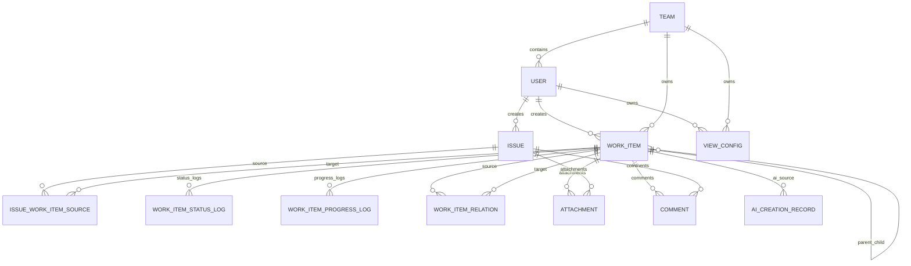

# 数据模型设计 - 工单系统 V1.0

> 文档路径：`/Users/estelle/工作-中电2025/07-Workspace/08-projects/工单系统/architecture/数据模型.md`
>
> 状态：初稿
>
> 更新日期：2026-05-29

---

## 1. 设计目标

数据模型需要支撑 P0.1 工单独立闭环，并为 P1/P2/P3 能力预留扩展。

P0.1 核心闭环：

```text
问题单 -> 人工分流 -> 工单 -> 叶子工单执行 -> 基础列表/统计
```

扩展预留：

- P1 工单二级拆分。
- P1 缺陷转需求。
- P1 个人/团队视图。
- P1 AI 自然语言创建工单。
- P2 高级统计和导出。
- P3 AI 智能分流和 GienCoder 联动。

---

## 2. ER 图



---

## 3. 枚举定义

### 3.1 问题单状态 issue_status

| 代码 | 中文 | 说明 |
|---|---|---|
| pending_triage | 待分流 | 新建后默认状态 |
| converted | 已转工单 | 已转为或关联工单 |
| closed | 已关闭 | 无需继续处理 |

### 3.2 线索类型 clue_type

| 代码 | 中文 | 说明 |
|---|---|---|
| demand_clue | 需求线索 | 可能转为业务需求或技术需求 |
| defect_clue | 缺陷线索 | 可能转为缺陷 |
| unknown | 未知 | 提交时无法判断 |

### 3.3 工单分类 work_item_type

| 代码 | 中文 | 说明 |
|---|---|---|
| business_requirement | 业务需求 | 业务流程、产品能力、体验、规则变化 |
| technical_requirement | 技术需求 | 架构、性能、稳定性、安全、工程效率 |
| defect | 缺陷 | 已有功能异常或不符合预期 |

### 3.4 工单来源 source_type

| 代码 | 中文 | 说明 |
|---|---|---|
| issue_converted | 问题单转入 | 来源于问题单分流或关联 |
| manual | 人为创建 | 用户表单创建 |
| defect_to_requirement | 缺陷转需求 | 来源于缺陷派生需求 |
| ai_created | AI 创建 | 用户自然语言经 AI 确认创建 |

### 3.5 工单状态 work_item_status

| 代码 | 中文 | 说明 |
|---|---|---|
| unassigned | 待分配 | 未指定执行人或团队 |
| ready_for_dev | 待开发 | 已指定执行人或团队，尚未开始 |
| in_progress | 开发中 | 正在处理 |
| completed | 已完成 | 处理完成 |
| canceled | 已取消 | 不再处理 |

### 3.6 优先级 priority

| 代码 | 中文 | 说明 |
|---|---|---|
| P0 | P0 | 最高优先级 |
| P1 | P1 | 高优先级 |
| P2 | P2 | 中优先级 |
| P3 | P3 | 低优先级 |

### 3.7 来源关系类型 source_relation_type

| 代码 | 中文 | 阶段 | 说明 |
|---|---|---|---|
| converted | 转入 | P0 | 问题单转工单 |
| associated | 关联 | P1 | 问题单关联已有工单 |
| merged_source | 合并来源 | P1 | 多问题单合并到同一工单 |

---

## 4. 核心表设计

## 4.1 issue 问题单表

### 表说明

问题单用于承载需求线索或缺陷线索，是工单的来源之一，不作为研发执行载体。

### 字段

| 字段 | 类型 | 必填 | 默认值 | 说明 |
|---|---|---|---|---|
| id | varchar(36) | 是 | - | 主键 UUID |
| issue_no | varchar(32) | 是 | - | 问题单编号，如 ISS-20260529-0001 |
| title | varchar(255) | 是 | - | 标题 |
| description | text | 是 | - | 描述 |
| clue_type | varchar(32) | 是 | unknown | demand_clue / defect_clue / unknown |
| status | varchar(32) | 是 | pending_triage | 问题单状态 |
| priority | varchar(8) | 否 | P2 | 优先级 |
| category | varchar(64) | 否 | null | 问题分类 |
| source_channel | varchar(64) | 否 | manual | 来源渠道 |
| submitter_id | varchar(36) | 是 | - | 提交人 |
| original_submitter_text | varchar(128) | 否 | null | 导入时无法匹配用户的原始提交人 |
| impact_scope | text | 否 | null | 影响范围 |
| expected_result | text | 否 | null | 期望结果 |
| actual_result | text | 否 | null | 实际结果 |
| reproduce_steps | text | 否 | null | 复现步骤 |
| external_no | varchar(128) | 否 | null | 外部编号 |
| close_reason_type | varchar(64) | 否 | null | 关闭原因类型 |
| close_reason | text | 否 | null | 关闭说明 |
| closed_by | varchar(36) | 否 | null | 关闭人 |
| closed_at | datetime | 否 | null | 关闭时间 |
| created_by | varchar(36) | 是 | - | 创建人 |
| created_at | datetime | 是 | now | 创建时间 |
| updated_at | datetime | 是 | now | 更新时间 |
| deleted_at | datetime | 否 | null | 软删除时间 |

### 索引

| 索引 | 字段 | 说明 |
|---|---|---|
| uk_issue_no | issue_no | 唯一编号 |
| idx_issue_status | status | 按状态查询 |
| idx_issue_submitter | submitter_id | 我的提交 |
| idx_issue_created_at | created_at | 时间筛选 |
| idx_issue_priority | priority | 优先级筛选 |
| idx_issue_clue_type | clue_type | 线索类型筛选 |
| idx_issue_external_no | external_no | 外部编号查询 |

### 关键约束

- title 不可为空。
- description 不可为空。
- status 只能按问题单状态机流转。
- closed 状态必须有 close_reason 或 close_reason_type。

---

## 4.2 work_item 工单表

### 表说明

工单是业务需求、技术需求、缺陷的统一管理对象。P0 中所有工单默认是叶子工单，P1 支持父子二级结构。

### 字段

| 字段 | 类型 | 必填 | 默认值 | 说明 |
|---|---|---|---|---|
| id | varchar(36) | 是 | - | 主键 UUID |
| work_item_no | varchar(32) | 是 | - | 工单编号，如 WI-20260529-0001 |
| title | varchar(255) | 是 | - | 标题 |
| description | text | 是 | - | 描述 |
| type | varchar(32) | 是 | - | business_requirement / technical_requirement / defect |
| source_type | varchar(32) | 是 | - | 来源类型 |
| status | varchar(32) | 是 | - | 工单状态 |
| progress | int | 是 | 0 | 0-100 |
| priority | varchar(8) | 否 | P2 | 优先级 |
| owner_id | varchar(36) | 否 | null | 负责人 |
| assignee_id | varchar(36) | 否 | null | 执行人 |
| team_id | varchar(36) | 否 | null | 执行团队 |
| parent_id | varchar(36) | 否 | null | 父工单 ID，P1 使用 |
| level | int | 是 | 1 | 1 或 2 |
| is_leaf | boolean | 是 | true | 是否叶子工单 |
| due_date | date | 否 | null | 截止时间 |
| completed_at | datetime | 否 | null | 完成时间 |
| canceled_at | datetime | 否 | null | 取消时间 |
| cancel_reason_type | varchar(64) | 否 | null | 取消原因类型 |
| cancel_reason | text | 否 | null | 取消说明 |
| source_defect_id | varchar(36) | 否 | null | 来源缺陷，P1 使用 |
| ai_creation_id | varchar(36) | 否 | null | AI 创建记录，P1 使用 |
| business_category | varchar(64) | 否 | null | 业务需求分类 |
| technical_category | varchar(64) | 否 | null | 技术需求分类 |
| severity | varchar(32) | 否 | null | 缺陷严重程度 |
| acceptance_criteria | text | 否 | null | 业务需求验收标准 |
| completion_criteria | text | 否 | null | 技术需求完成标准 |
| risk_note | text | 否 | null | 技术风险说明 |
| expected_result | text | 否 | null | 缺陷期望结果 |
| actual_result | text | 否 | null | 缺陷实际结果 |
| reproduce_steps | text | 否 | null | 缺陷复现步骤 |
| impact_scope | text | 否 | null | 影响范围 |
| created_by | varchar(36) | 是 | - | 创建人 |
| created_at | datetime | 是 | now | 创建时间 |
| updated_at | datetime | 是 | now | 更新时间 |
| deleted_at | datetime | 否 | null | 软删除时间 |

### 索引

| 索引 | 字段 | 说明 |
|---|---|---|
| uk_work_item_no | work_item_no | 唯一编号 |
| idx_work_item_type | type | 分类筛选 |
| idx_work_item_status | status | 状态筛选 |
| idx_work_item_source_type | source_type | 来源筛选 |
| idx_work_item_owner | owner_id | 负责人筛选 |
| idx_work_item_assignee | assignee_id | 执行人筛选 |
| idx_work_item_team | team_id | 团队筛选 |
| idx_work_item_parent | parent_id | 父子查询 |
| idx_work_item_is_leaf | is_leaf | 叶子工单筛选 |
| idx_work_item_due_date | due_date | 截止时间筛选 |
| idx_work_item_created_at | created_at | 创建时间筛选 |

### 关键约束

- title 不可为空。
- description 不可为空。
- type 必须为业务需求、技术需求、缺陷之一。
- progress 范围为 0-100。
- level 只能为 1 或 2。
- P0 中 parent_id 为空、level=1、is_leaf=true。
- P1 中 level=2 的工单不可有子工单。
- completed 状态 progress 必须为 100。
- canceled 状态必须有取消原因。

---

## 4.3 issue_work_item_source 问题单-工单来源关系表

### 表说明

记录问题单与工单之间的 n:n 来源关系。

### 字段

| 字段 | 类型 | 必填 | 默认值 | 说明 |
|---|---|---|---|---|
| id | varchar(36) | 是 | - | 主键 UUID |
| issue_id | varchar(36) | 是 | - | 问题单 ID |
| work_item_id | varchar(36) | 是 | - | 工单 ID |
| relation_type | varchar(32) | 是 | converted | converted / associated / merged_source |
| note | text | 否 | null | 来源说明 |
| created_by | varchar(36) | 是 | - | 操作人 |
| created_at | datetime | 是 | now | 创建时间 |

### 索引与约束

| 类型 | 字段 | 说明 |
|---|---|---|
| unique | issue_id, work_item_id | 避免重复关系 |
| index | issue_id | 查询问题单关联工单 |
| index | work_item_id | 查询工单来源问题单 |
| index | relation_type | 按关系类型查询 |

---

## 4.4 work_item_relation 工单间关系表

### 表说明

记录工单与工单之间的派生关系，P1 主要用于缺陷转需求。

### 字段

| 字段 | 类型 | 必填 | 默认值 | 说明 |
|---|---|---|---|---|
| id | varchar(36) | 是 | - | 主键 UUID |
| source_work_item_id | varchar(36) | 是 | - | 来源工单，如缺陷 |
| target_work_item_id | varchar(36) | 是 | - | 目标工单，如派生需求 |
| relation_type | varchar(32) | 是 | defect_to_requirement | 关系类型 |
| note | text | 否 | null | 说明 |
| created_by | varchar(36) | 是 | - | 操作人 |
| created_at | datetime | 是 | now | 创建时间 |

### 约束

- source_work_item_id + target_work_item_id + relation_type 唯一。
- P1 缺陷转需求时，source 必须是 defect，target 必须是 business_requirement 或 technical_requirement。

---

## 4.5 work_item_status_log 状态日志表

### 表说明

记录工单状态变化，用于追溯和统计阶段耗时。

### 字段

| 字段 | 类型 | 必填 | 默认值 | 说明 |
|---|---|---|---|---|
| id | varchar(36) | 是 | - | 主键 UUID |
| work_item_id | varchar(36) | 是 | - | 工单 ID |
| from_status | varchar(32) | 否 | null | 原状态 |
| to_status | varchar(32) | 是 | - | 目标状态 |
| operator_id | varchar(36) | 是 | - | 操作人 |
| reason | text | 否 | null | 原因 |
| created_at | datetime | 是 | now | 创建时间 |

### 索引

| 索引 | 字段 | 说明 |
|---|---|---|
| idx_status_log_work_item | work_item_id | 查询工单状态历史 |
| idx_status_log_created_at | created_at | 阶段耗时统计 |
| idx_status_log_to_status | to_status | 状态统计 |

---

## 4.6 work_item_progress_log 进度日志表

### 表说明

记录叶子工单进度变化，用于追溯执行进展。

### 字段

| 字段 | 类型 | 必填 | 默认值 | 说明 |
|---|---|---|---|---|
| id | varchar(36) | 是 | - | 主键 UUID |
| work_item_id | varchar(36) | 是 | - | 工单 ID |
| from_progress | int | 是 | - | 原进度 |
| to_progress | int | 是 | - | 新进度 |
| operator_id | varchar(36) | 是 | - | 操作人 |
| note | text | 否 | null | 进度说明 |
| created_at | datetime | 是 | now | 创建时间 |

### 约束

- from_progress 和 to_progress 范围 0-100。
- P0 手动更新仅允许 1-99。
- 完成动作自动写入 100。

---

## 4.7 issue_status_log 问题单状态日志表

### 表说明

记录问题单状态变化，例如转工单、关闭、重新打开。

### 字段

| 字段 | 类型 | 必填 | 默认值 | 说明 |
|---|---|---|---|---|
| id | varchar(36) | 是 | - | 主键 UUID |
| issue_id | varchar(36) | 是 | - | 问题单 ID |
| from_status | varchar(32) | 否 | null | 原状态 |
| to_status | varchar(32) | 是 | - | 目标状态 |
| operator_id | varchar(36) | 是 | - | 操作人 |
| reason | text | 否 | null | 原因 |
| created_at | datetime | 是 | now | 创建时间 |

---

## 4.8 attachment 附件表

### 表说明

统一记录问题单和工单附件。

### 字段

| 字段 | 类型 | 必填 | 默认值 | 说明 |
|---|---|---|---|---|
| id | varchar(36) | 是 | - | 主键 UUID |
| target_type | varchar(32) | 是 | - | issue / work_item |
| target_id | varchar(36) | 是 | - | 目标对象 ID |
| file_name | varchar(255) | 是 | - | 文件名 |
| file_url | varchar(512) | 是 | - | 文件地址 |
| file_size | bigint | 否 | null | 文件大小 |
| mime_type | varchar(128) | 否 | null | 文件类型 |
| uploader_id | varchar(36) | 是 | - | 上传人 |
| created_at | datetime | 是 | now | 创建时间 |
| deleted_at | datetime | 否 | null | 删除时间 |

---

## 4.9 comment 评论表

### 表说明

统一记录问题单和工单评论。P0 可选，P1 增强。

### 字段

| 字段 | 类型 | 必填 | 默认值 | 说明 |
|---|---|---|---|---|
| id | varchar(36) | 是 | - | 主键 UUID |
| target_type | varchar(32) | 是 | - | issue / work_item |
| target_id | varchar(36) | 是 | - | 目标对象 ID |
| content | text | 是 | - | 评论内容 |
| creator_id | varchar(36) | 是 | - | 创建人 |
| created_at | datetime | 是 | now | 创建时间 |
| updated_at | datetime | 否 | null | 更新时间 |
| deleted_at | datetime | 否 | null | 删除时间 |

---

## 4.10 audit_log 操作日志表

### 表说明

记录关键操作，用于审计与追溯。

### 字段

| 字段 | 类型 | 必填 | 默认值 | 说明 |
|---|---|---|---|---|
| id | varchar(36) | 是 | - | 主键 UUID |
| target_type | varchar(32) | 是 | - | issue / work_item / view / import_task 等 |
| target_id | varchar(36) | 是 | - | 目标对象 ID |
| action | varchar(64) | 是 | - | 操作类型 |
| operator_id | varchar(36) | 是 | - | 操作人 |
| detail | json | 否 | null | 操作详情 |
| created_at | datetime | 是 | now | 创建时间 |

---

## 5. P0.2/P1 扩展表

## 5.1 issue_import_task 导入任务表

P0.2 支持批量导入问题单。

| 字段 | 类型 | 说明 |
|---|---|---|
| id | varchar(36) | 主键 |
| file_name | varchar(255) | 文件名 |
| file_url | varchar(512) | 文件地址 |
| file_format | varchar(16) | xlsx / csv |
| status | varchar(32) | pending_confirm / importing / success / partial_success / failed |
| total_count | int | 总行数 |
| success_count | int | 成功数 |
| failed_count | int | 失败数 |
| skipped_count | int | 跳过数 |
| error_detail | json | 失败明细 |
| created_issue_ids | json | 创建的问题单 ID |
| created_by | varchar(36) | 导入人 |
| created_at | datetime | 创建时间 |
| updated_at | datetime | 更新时间 |

## 5.2 view_config 视图配置表

P0.2/P1 支持个人视图、团队视图。

| 字段 | 类型 | 说明 |
|---|---|---|
| id | varchar(36) | 主键 |
| name | varchar(128) | 视图名称 |
| view_type | varchar(32) | list / table / board |
| scope | varchar(32) | personal / team |
| owner_id | varchar(36) | 个人视图所有人 |
| team_id | varchar(36) | 团队视图所属团队 |
| filters | json | 筛选配置 |
| group_by | json | 分组配置 |
| sort_by | json | 排序配置 |
| visible_fields | json | 字段配置 |
| created_by | varchar(36) | 创建人 |
| created_at | datetime | 创建时间 |
| updated_at | datetime | 更新时间 |
| deleted_at | datetime | 删除时间 |

## 5.3 ai_creation_record AI 创建记录表

P1 支持 AI 自然语言创建工单。

| 字段 | 类型 | 说明 |
|---|---|---|
| id | varchar(36) | 主键 |
| raw_input | text | 原始自然语言输入 |
| suggested_type | varchar(32) | AI 建议分类 |
| generated_draft | json | AI 生成草稿 |
| final_content | json | 用户确认内容 |
| confirmed_by | varchar(36) | 确认人 |
| confirmed_at | datetime | 确认时间 |
| model_info | varchar(128) | 模型信息 |
| created_at | datetime | 创建时间 |

## 5.4 ai_triage_suggestion AI 分流建议表

P3 支持 AI 智能问题单分流。

| 字段 | 类型 | 说明 |
|---|---|---|
| id | varchar(36) | 主键 |
| issue_id | varchar(36) | 问题单 ID |
| suggestion_type | varchar(64) | 分类/优先级/负责人/相似项 |
| suggestion_content | json | 建议内容 |
| confidence | decimal | 置信度 |
| user_action | varchar(32) | accepted / modified / rejected |
| final_result | json | 人工最终结果 |
| operator_id | varchar(36) | 操作人 |
| created_at | datetime | 创建时间 |
| handled_at | datetime | 处理时间 |

---

## 6. 字段设计关键口径

### 6.1 负责人与执行人

| 字段 | 含义 |
|---|---|
| owner_id | 工单责任人，对工单管理负责 |
| assignee_id | 具体执行人 |
| team_id | 执行团队或负责团队 |

状态初始化只看 `assignee_id` 或 `team_id`，不看 `owner_id`。

```text
有 assignee_id 或 team_id => ready_for_dev
无 assignee_id 且无 team_id => unassigned
```

### 6.2 父工单字段预留

P0 中：

```text
parent_id = null
level = 1
is_leaf = true
```

P1 中：

```text
一级父工单：level = 1, is_leaf = false
二级子工单：level = 2, is_leaf = true
```

### 6.3 来源追溯

问题单转工单：

- work_item.source_type = issue_converted
- issue_work_item_source 写入关系

手动创建：

- work_item.source_type = manual

缺陷转需求：

- work_item.source_type = defect_to_requirement
- work_item.source_defect_id = 来源缺陷 ID
- work_item_relation 写入关系

AI 创建：

- work_item.source_type = ai_created
- work_item.ai_creation_id = AI 创建记录 ID

---

## 7. 统计口径数据来源

| 指标 | 数据来源 |
|---|---|
| 问题单总数 | issue |
| 待分流问题数 | issue.status |
| 已转工单问题数 | issue.status |
| 工单总数 | work_item |
| 工单分类统计 | work_item.type |
| 工单状态统计 | work_item.status |
| 叶子工单数 | work_item.is_leaf |
| 完成率 | work_item.status + is_leaf |
| 问题转化率 | issue.status + issue_work_item_source |
| 缺陷修复周期 | work_item.type/status/completed_at |
| 分流时长 | issue.created_at + issue_status_log |

---

## 8. 数据一致性规则

1. 问题单转工单必须保证工单、来源关系、问题单状态同事务提交。
2. 工单状态变更必须写入状态日志。
3. 工单进度变更必须写入进度日志。
4. 工单完成时 progress 必须为 100。
5. 已取消工单必须有取消原因。
6. 已关闭问题单必须有关闭原因。
7. 来源类型不可通过普通编辑修改。
8. 工单分类创建后默认不可修改。
9. P1 父工单状态和进度不可手动修改。
10. 删除优先采用软删除，避免破坏来源追溯。

---

## 9. 后续细化

1. 根据实际技术栈生成 SQL DDL。
2. 明确编号生成规则。
3. 明确字典表是否独立建模。
4. 明确附件存储方案。
5. 明确审计日志保留周期。
6. 明确统计是否需要快照表。

