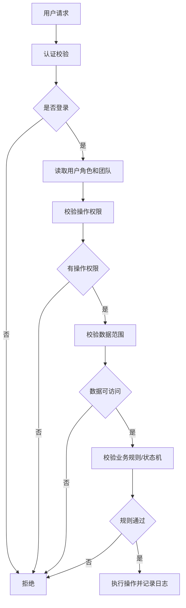

# 权限模型设计 - 工单系统 V1.0

> 文档路径：`/Users/estelle/工作-中电2025/07-Workspace/08-projects/工单系统/architecture/权限模型.md`
>
> 状态：初稿
>
> 更新日期：2026-05-29

---

## 1. 设计目标

权限模型用于控制用户可以访问哪些问题单、工单、视图和统计，并控制用户可以执行哪些操作。

P0 优先支持简单、稳定、可落地的权限模型：

```text
角色权限 + 数据范围
```

后续可扩展项目、产品线、业务域、字段级权限等。

---

## 2. 核心原则

1. 操作权限和数据范围分离。
2. 所有列表、详情、统计都必须遵守数据范围。
3. 状态动作必须同时校验操作权限、数据权限和状态机规则。
4. 问题单与工单权限分开控制。
5. 父工单和子工单遵守相同数据范围规则。
6. 管理员权限不绕过操作日志。
7. P0 先支持本人、团队、全部三种数据范围。

---

## 3. 角色定义

| 角色 | 说明 |
|---|---|
| submitter | 问题提交人 |
| triager | 分流处理人 |
| product_manager | 产品经理 |
| tech_lead | 技术负责人 / 架构师 |
| qa | 测试 / 质量人员 |
| developer | 研发执行人 |
| project_manager | 项目经理 / 管理者 |
| work_item_admin | 工单管理员 |
| system_admin | 系统管理员 |

---

## 4. 数据范围

| 范围 | 代码 | 说明 |
|---|---|---|
| 本人 | self | 用户自己创建、提交、负责或执行的数据 |
| 团队 | team | 用户所属团队或授权团队的数据 |
| 全部 | all | 全部数据，管理员使用 |

### 4.1 问题单数据范围

| 范围 | 规则 |
|---|---|
| self | submitter_id = 当前用户 或 created_by = 当前用户 |
| team | submitter 所属团队 = 当前用户授权团队，或问题单归属团队，若后续有该字段 |
| all | 不限制 |

### 4.2 工单数据范围

| 范围 | 规则 |
|---|---|
| self | owner_id / assignee_id / created_by = 当前用户 |
| team | team_id in 当前用户授权团队，或 assignee 所属团队 in 授权团队 |
| all | 不限制 |

---

## 5. 权限动作

### 5.1 问题单权限

| 权限 | 说明 |
|---|---|
| issue:create | 创建问题单 |
| issue:update | 编辑问题单 |
| issue:view | 查看问题单 |
| issue:triage | 分流问题单 |
| issue:close | 关闭问题单 |
| issue:reopen | 重新打开问题单，P1 |
| issue:import | 批量导入问题单，P0.2 |

### 5.2 工单权限

| 权限 | 说明 |
|---|---|
| work_item:create | 创建工单 |
| work_item:update | 编辑工单 |
| work_item:view | 查看工单 |
| work_item:assign | 分配工单 |
| work_item:start | 开始处理 |
| work_item:update_progress | 更新进度 |
| work_item:complete | 完成工单 |
| work_item:cancel | 取消工单 |
| work_item:reopen | 重新打开，P1 |
| work_item:reactivate | 重新启用，P1 |
| work_item:split | 拆分工单，P1 |
| work_item:convert_defect_to_requirement | 缺陷转需求，P1 |

### 5.3 视图与统计权限

| 权限 | 说明 |
|---|---|
| view:personal_manage | 管理个人视图 |
| view:team_manage | 管理团队视图 |
| metric:view | 查看指标统计 |
| metric:export | 导出统计，P2 |

### 5.4 系统权限

| 权限 | 说明 |
|---|---|
| admin:user_manage | 用户管理 |
| admin:team_manage | 团队管理 |
| admin:role_manage | 角色权限管理 |
| admin:dict_manage | 字典配置 |
| admin:system_config | 系统配置 |

---

## 6. 默认角色权限矩阵

### 6.1 问题单权限矩阵

| 角色 | view | create | update | triage | close | import |
|---|---|---|---|---|---|---|
| submitter | self | yes | self | no | no | no |
| triager | team | yes | team | team | team | no |
| product_manager | team | yes | team | team | team | no |
| tech_lead | team | yes | team | team | team | no |
| qa | team | yes | team | team | team | no |
| developer | self/team | yes | self | no | no | no |
| project_manager | team | yes | team | team | team | no |
| work_item_admin | all | yes | all | all | all | yes |
| system_admin | all | yes | all | all | all | yes |

### 6.2 工单权限矩阵

| 角色 | view | create | update | assign | start/progress/complete | cancel |
|---|---|---|---|---|---|---|
| submitter | self-related | no | no | no | no | no |
| triager | team | yes | team | team | no | team |
| product_manager | team | business_requirement | business_requirement | team | no | team |
| tech_lead | team | technical_requirement | technical_requirement | team | no | team |
| qa | team | defect | defect | team | no | team |
| developer | assigned | no | limited | no | assigned | assigned |
| project_manager | team | yes | team | team | no | team |
| work_item_admin | all | yes | all | all | all | all |
| system_admin | all | yes | all | all | all | all |

说明：

- developer 可以对分配给自己的叶子工单执行开始、进度更新、完成。
- cancel 默认建议由负责人、项目经理、管理员执行；是否允许 developer 取消可配置。
- 产品经理、技术负责人、QA 的 create/update 可按工单类型限制。

---

## 7. 状态动作权限

| 动作 | 操作权限 | 数据范围 | 状态机要求 | 其他条件 |
|---|---|---|---|---|
| 分配 | work_item:assign | 工单可见且可管理 | unassigned -> ready_for_dev | 必须选择执行人或团队 |
| 开始处理 | work_item:start | assigned 或管理权限 | ready_for_dev -> in_progress | 叶子工单 |
| 更新进度 | work_item:update_progress | assigned 或管理权限 | in_progress | 进度 1-99，叶子工单 |
| 完成 | work_item:complete | assigned 或管理权限 | in_progress -> completed | 叶子工单 |
| 取消 | work_item:cancel | 管理权限 | unassigned/ready/in_progress -> canceled | 取消原因必填 |
| 重新打开 | work_item:reopen | 管理权限 | completed -> ready_for_dev | 原因必填，P1 |
| 重新启用 | work_item:reactivate | 管理权限 | canceled -> unassigned/ready_for_dev | 原因必填，P1 |

---

## 8. 特殊权限规则

### 8.1 父工单

P1：

- 父工单可查看。
- 父工单不可手动推进状态。
- 父工单不可手动更新进度。
- 父工单可编辑基础信息，需有管理权限。
- 父工单不能被分配为执行任务。

### 8.2 来源追溯

- 用户能查看工单时，可以查看来源类型。
- 来源问题单详情跳转需要校验 issue:view。
- 来源缺陷详情跳转需要校验 work_item:view。
- 若无权限查看来源对象，展示“无权限查看”。

### 8.3 个人视图和团队视图

- 个人视图仅创建人可见和管理。
- 团队视图对所属团队成员可见。
- 创建或修改团队视图需要 view:team_manage。
- 个人视图转团队视图需要个人视图所有权 + 团队视图管理权限。

### 8.4 统计权限

- metric:view 只表示可进入统计页面。
- 实际统计数据仍按数据范围过滤。
- 管理者看团队范围，管理员看全部。

---

## 9. 权限校验流程



---

## 10. P0 简化建议

P0 可以先用以下简化模型：

1. 用户只属于一个主团队。
2. 角色可以多选。
3. 数据范围使用角色默认范围。
4. 暂不做字段级权限。
5. 暂不做项目级权限。
6. 暂不做复杂组织层级。

---

## 11. 后续扩展

1. 项目级数据范围。
2. 产品线 / 业务域数据范围。
3. 字段级权限。
4. 操作审批权限。
5. 多团队授权。
6. 权限模板和继承。

