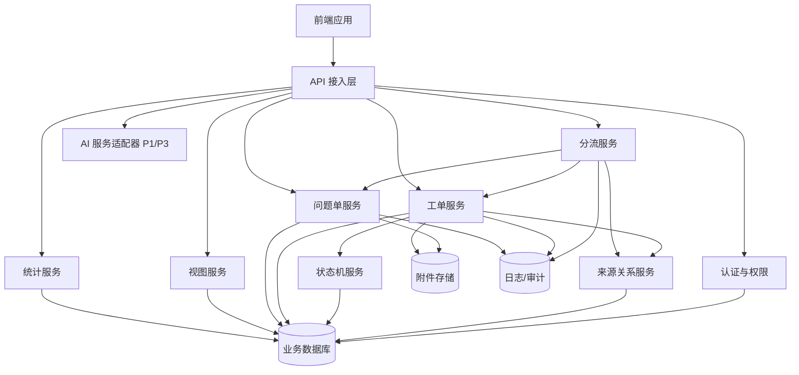
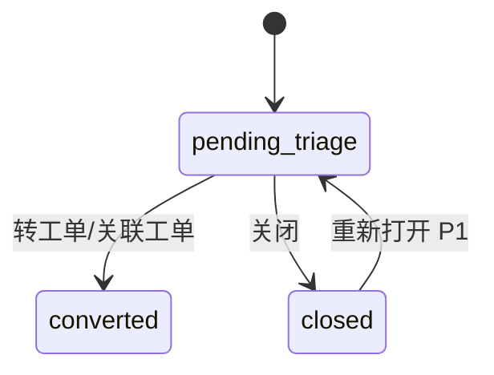
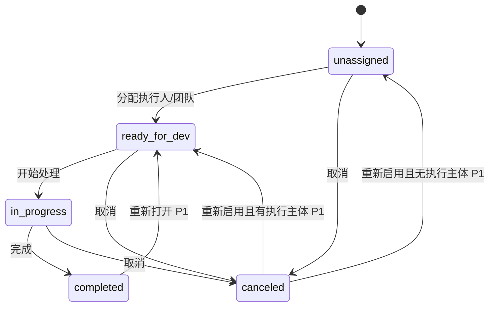

# 架构设计 - 工单系统 V1.0

> 文档路径：`/Users/estelle/工作-中电2025/07-Workspace/08-projects/工单系统/architecture/架构设计.md`
>
> 状态：初稿
>
> 更新日期：2026-05-29

---

## 1. 架构目标

本架构设计基于 P0 MVP 范围，目标是支撑工单系统独立闭环：

```text
问题单输入 -> 人工分流 -> 工单创建 -> 叶子工单执行 -> 列表/统计
```

同时为 P1 的工单拆分、父工单计算、视图增强、AI 自然语言创建工单，以及 P3 的 AI 智能分流和 GienCoder 联动预留扩展能力。

---

## 2. 架构原则

1. 核心领域对象清晰：问题单、工单、来源关系、状态日志、进度日志。
2. 状态机集中管理，避免状态散落在业务代码中。
3. 来源关系独立建模，支撑问题单与工单 n:n。
4. P0 不做拆分，但数据模型预留父子关系字段。
5. 执行口径以叶子工单为准。
6. 查询与统计分层，避免复杂统计侵入核心事务逻辑。
7. 操作日志、状态日志、进度日志独立记录，支撑追溯和统计。
8. AI 能力作为外部增强服务接入，不侵入核心工单状态机。

---

## 3. 逻辑架构



---

## 4. 核心模块

### 4.1 问题单服务 Issue Service

职责：

- 问题单手动创建。
- 问题单编辑。
- 问题单列表与详情查询。
- 问题单批量导入，P0.2。
- 问题单状态维护：待分流、已转工单、已关闭。
- 问题单关闭与重新打开，重新打开 P1。

核心能力：

| 能力 | P0.1 | P0.2/P1 |
|---|---|---|
| 创建问题单 | 是 | - |
| 编辑问题单 | 是 | - |
| 查询问题单 | 是 | - |
| 关闭问题单 | 是 | - |
| 批量导入 | 否 | P0.2 |
| 重新打开 | 否 | P1 |

### 4.2 分流服务 Triage Service

职责：

- 问题单人工分流。
- 问题单转业务需求。
- 问题单转技术需求。
- 问题单转缺陷。
- 问题单关闭。
- P1 支持关联已有工单、多问题单合并、一个问题单转多个工单。
- P3 接入 AI 智能分流建议。

事务要求：

- 转工单时，需要在同一事务中完成工单创建、来源关系创建、问题单状态更新、操作日志记录。
- 任一关键步骤失败，需要回滚。

### 4.3 工单服务 Work Item Service

职责：

- 手动创建业务需求、技术需求、缺陷。
- 工单详情与编辑。
- 来源追溯。
- 工单状态机动作入口。
- P1 支持工单拆分、缺陷转需求。

核心规则：

- 工单分类：业务需求、技术需求、缺陷。
- 来源类型：问题单转入、人为创建、缺陷转需求、AI 创建。
- P0.1 中所有工单默认为叶子工单。
- 创建时指定执行人或团队，则状态为待开发；否则待分配。

### 4.4 状态机服务 Workflow Service

职责：

- 统一校验工单状态流转。
- 记录状态日志。
- 执行状态变更副作用，例如完成时进度设为 100%。
- P1 支持父工单状态和进度重算触发。

P0 状态流转：

```text
待分配 -> 待开发
待开发 -> 开发中
开发中 -> 已完成
待分配 -> 已取消
待开发 -> 已取消
开发中 -> 已取消
```

P1 扩展：

```text
已完成 -> 待开发
已取消 -> 待分配 / 待开发
```

### 4.5 来源关系服务 Source Service

职责：

- 管理问题单与工单来源关系。
- 支持工单来源追溯。
- P1 支持来源缺陷关系。
- P1/P3 支持 AI 创建来源追溯。

P0 必做：

- issue_work_item_source 表维护。
- 问题单转工单时建立来源关系。
- 工单详情展示来源问题单。
- 问题单详情展示关联工单。

### 4.6 统计服务 Metric Service

职责：

- 基础指标统计。
- 工单分类统计。
- 工单状态分布统计。
- P1/P2 扩展问题转化、完成率、周期、负载、导出。

P0.1 建议采用实时查询统计，不单独做指标快照。

后续数据量增长后，可增加：

- metric_snapshot。
- 异步统计任务。
- 数据仓库或分析表。

### 4.7 视图服务 View Service

P0.1：可先提供系统默认列表和基础筛选，不要求保存个人/团队视图。

P0.2/P1：支持视图配置表：

- 个人视图。
- 团队视图。
- 表格视图。
- 泳道看板。
- 自定义筛选、分组、排序。

### 4.8 AI 服务适配器 AI Adapter

P1：AI 自然语言创建工单。

P3：AI 智能问题单分流。

设计原则：

- AI 只生成建议或草稿。
- 用户确认后才写入正式业务表。
- AI 请求、响应、用户修改和确认需要留痕。
- AI 能力不直接修改问题单和工单状态。

---

## 5. 数据模型初稿

### 5.1 issue 问题单表

| 字段 | 类型 | 说明 |
|---|---|---|
| id | string | 主键 |
| issue_no | string | 问题单编号 |
| title | string | 标题 |
| description | text | 描述 |
| clue_type | enum | demand_clue / defect_clue / unknown |
| status | enum | pending_triage / converted / closed |
| priority | enum | P0 / P1 / P2 / P3 |
| category | string | 问题分类 |
| source_channel | string | 来源渠道 |
| submitter_id | string | 提交人 |
| impact_scope | text | 影响范围 |
| expected_result | text | 期望结果 |
| actual_result | text | 实际结果 |
| reproduce_steps | text | 复现步骤 |
| close_reason | text | 关闭原因 |
| closed_by | string | 关闭人 |
| closed_at | datetime | 关闭时间 |
| created_by | string | 创建人 |
| created_at | datetime | 创建时间 |
| updated_at | datetime | 更新时间 |
| deleted_at | datetime | 软删除时间 |

### 5.2 work_item 工单表

| 字段 | 类型 | 说明 |
|---|---|---|
| id | string | 主键 |
| work_item_no | string | 工单编号 |
| title | string | 标题 |
| description | text | 描述 |
| type | enum | business_requirement / technical_requirement / defect |
| source_type | enum | issue_converted / manual / defect_to_requirement / ai_created |
| status | enum | unassigned / ready_for_dev / in_progress / completed / canceled |
| progress | int | 0-100 |
| priority | enum | P0 / P1 / P2 / P3 |
| owner_id | string | 负责人 |
| assignee_id | string | 执行人 |
| team_id | string | 执行团队 |
| parent_id | string | 父工单，P1 使用，P0 预留 |
| level | int | 1/2，P0 默认 1 |
| is_leaf | boolean | 是否叶子工单，P0 默认 true |
| due_date | date | 截止时间 |
| completed_at | datetime | 完成时间 |
| canceled_at | datetime | 取消时间 |
| cancel_reason | text | 取消原因 |
| source_defect_id | string | 来源缺陷，P1 使用 |
| ai_creation_id | string | AI 创建记录，P1 使用 |
| created_by | string | 创建人 |
| created_at | datetime | 创建时间 |
| updated_at | datetime | 更新时间 |
| deleted_at | datetime | 软删除时间 |

### 5.3 issue_work_item_source 来源关系表

| 字段 | 类型 | 说明 |
|---|---|---|
| id | string | 主键 |
| issue_id | string | 问题单 ID |
| work_item_id | string | 工单 ID |
| relation_type | enum | converted / associated / merged_source |
| created_by | string | 操作人 |
| created_at | datetime | 创建时间 |

约束：

- issue_id + work_item_id 唯一，避免重复关系。
- P0 主要使用 converted。
- P1 使用 associated、merged_source。

### 5.4 work_item_status_log 状态日志表

| 字段 | 类型 | 说明 |
|---|---|---|
| id | string | 主键 |
| work_item_id | string | 工单 ID |
| from_status | enum | 原状态 |
| to_status | enum | 目标状态 |
| operator_id | string | 操作人 |
| reason | text | 原因 |
| created_at | datetime | 创建时间 |

### 5.5 work_item_progress_log 进度日志表

| 字段 | 类型 | 说明 |
|---|---|---|
| id | string | 主键 |
| work_item_id | string | 工单 ID |
| from_progress | int | 原进度 |
| to_progress | int | 目标进度 |
| operator_id | string | 操作人 |
| note | text | 进度备注 |
| created_at | datetime | 创建时间 |

### 5.6 audit_log 操作日志表

| 字段 | 类型 | 说明 |
|---|---|---|
| id | string | 主键 |
| target_type | string | issue / work_item / view 等 |
| target_id | string | 对象 ID |
| action | string | 操作类型 |
| operator_id | string | 操作人 |
| detail | json | 操作详情 |
| created_at | datetime | 创建时间 |

### 5.7 view_config 视图配置表，P0.2/P1

| 字段 | 类型 | 说明 |
|---|---|---|
| id | string | 主键 |
| name | string | 视图名称 |
| view_type | enum | list / table / board |
| scope | enum | personal / team |
| owner_id | string | 个人视图所有人 |
| team_id | string | 团队视图所属团队 |
| filters | json | 筛选配置 |
| group_by | json | 分组配置 |
| sort_by | json | 排序配置 |
| visible_fields | json | 字段配置 |
| created_by | string | 创建人 |
| created_at | datetime | 创建时间 |
| updated_at | datetime | 更新时间 |

### 5.8 ai_creation_record AI 创建记录表，P1

| 字段 | 类型 | 说明 |
|---|---|---|
| id | string | 主键 |
| raw_input | text | 原始自然语言输入 |
| suggested_type | enum | AI 建议工单分类 |
| generated_draft | json | AI 生成草稿 |
| final_content | json | 用户确认后的内容 |
| confirmed_by | string | 确认人 |
| confirmed_at | datetime | 确认时间 |
| model_info | string | 模型信息，可选 |
| created_at | datetime | 创建时间 |

---

## 6. 状态机设计

### 6.1 问题单状态

| 状态 | 代码 | 说明 |
|---|---|---|
| 待分流 | pending_triage | 问题单已创建，等待处理 |
| 已转工单 | converted | 已转为或关联工单 |
| 已关闭 | closed | 不再处理 |

状态流转：



### 6.2 工单状态

| 状态 | 代码 | 说明 |
|---|---|---|
| 待分配 | unassigned | 尚未指定执行主体 |
| 待开发 | ready_for_dev | 已指定执行主体，尚未开始 |
| 开发中 | in_progress | 正在处理 |
| 已完成 | completed | 处理完成 |
| 已取消 | canceled | 不再处理 |

状态流转：



### 6.3 状态机校验规则

- 状态流转必须通过状态机服务。
- 不允许直接更新状态字段绕过校验。
- 每次状态变更必须记录状态日志。
- 取消必须填写原因。
- 完成时进度自动为 100%。
- 开发中状态允许更新 1%-99% 进度。
- 父工单 P1 之后不允许手动状态流转。

---

## 7. 核心事务设计

### 7.1 问题单转工单事务

步骤：

1. 校验问题单存在且状态为待分流。
2. 校验用户分流权限。
3. 创建工单。
4. 创建 issue_work_item_source 来源关系。
5. 更新问题单状态为已转工单。
6. 写入状态日志和操作日志。
7. 提交事务。

失败处理：

- 工单创建失败：问题单保持待分流。
- 来源关系创建失败：回滚工单创建。
- 问题单状态更新失败：回滚工单和来源关系。

### 7.2 手动创建工单事务

步骤：

1. 校验用户创建权限。
2. 校验标题、描述、工单分类。
3. 计算初始状态。
4. 创建工单。
5. 写入初始状态日志。
6. 写入操作日志。

### 7.3 叶子工单状态变更事务

步骤：

1. 校验工单存在。
2. 校验工单为叶子工单。
3. 校验用户权限。
4. 校验状态流转合法。
5. 执行状态副作用，例如完成时进度 100%。
6. 更新工单状态和相关时间字段。
7. 写入状态日志。
8. P1 如有父工单，触发父工单重算。

### 7.4 叶子工单进度更新事务

步骤：

1. 校验工单为叶子工单。
2. 校验状态为开发中。
3. 校验进度为 1%-99%。
4. 更新进度。
5. 写入进度日志。
6. P1 如有父工单，触发父工单进度重算。

---

## 8. 权限模型初稿

### 8.1 角色

| 角色 | 说明 |
|---|---|
| 问题提交人 | 创建和查看自己的问题单 |
| 分流处理人 | 分流授权范围内问题单 |
| 产品经理 | 管理业务需求 |
| 技术负责人 | 管理技术需求 |
| 测试 / 质量人员 | 管理缺陷 |
| 研发执行人 | 处理分配给自己的叶子工单 |
| 项目经理 / 管理者 | 查看授权范围内看板和统计 |
| 工单管理员 | 管理授权范围内问题单和工单 |
| 系统管理员 | 全局配置和管理 |

### 8.2 权限动作

| 权限 | 说明 |
|---|---|
| issue:create | 创建问题单 |
| issue:update | 编辑问题单 |
| issue:view | 查看问题单 |
| issue:triage | 分流问题单 |
| issue:close | 关闭问题单 |
| work_item:create | 创建工单 |
| work_item:update | 编辑工单 |
| work_item:view | 查看工单 |
| work_item:assign | 分配工单 |
| work_item:transition | 推进状态 |
| work_item:update_progress | 更新进度 |
| metric:view | 查看统计 |
| view:manage_personal | 管理个人视图 |
| view:manage_team | 管理团队视图 |
| admin:config | 系统配置 |

### 8.3 数据范围

P0 建议支持：

- 本人。
- 所属团队。
- 全部，管理员。

后续可扩展项目、业务域、产品线等数据范围。

---

## 9. API 边界初稿

### 9.1 问题单 API

| 方法 | 路径 | 说明 |
|---|---|---|
| POST | /api/issues | 创建问题单 |
| PUT | /api/issues/{id} | 编辑问题单 |
| GET | /api/issues | 问题单列表 |
| GET | /api/issues/{id} | 问题单详情 |
| POST | /api/issues/{id}/close | 关闭问题单 |
| POST | /api/issues/import | 批量导入，P0.2 |

### 9.2 分流 API

| 方法 | 路径 | 说明 |
|---|---|---|
| POST | /api/issues/{id}/triage/business-requirement | 转业务需求 |
| POST | /api/issues/{id}/triage/technical-requirement | 转技术需求 |
| POST | /api/issues/{id}/triage/defect | 转缺陷 |
| POST | /api/issues/{id}/triage/associate | 关联已有工单，P1 |
| POST | /api/issues/{id}/triage/multi-create | 一个问题单转多个工单，P1 |

### 9.3 工单 API

| 方法 | 路径 | 说明 |
|---|---|---|
| POST | /api/work-items | 创建工单 |
| PUT | /api/work-items/{id} | 编辑工单 |
| GET | /api/work-items | 工单列表 |
| GET | /api/work-items/{id} | 工单详情 |
| POST | /api/work-items/{id}/assign | 分配 |
| POST | /api/work-items/{id}/start | 开始处理 |
| POST | /api/work-items/{id}/progress | 更新进度 |
| POST | /api/work-items/{id}/complete | 完成 |
| POST | /api/work-items/{id}/cancel | 取消 |
| POST | /api/work-items/{id}/reopen | 重新打开，P1 |
| POST | /api/work-items/{id}/reactivate | 重新启用，P1 |
| POST | /api/work-items/{id}/split | 拆分，P1 |
| POST | /api/work-items/{id}/convert-to-requirement | 缺陷转需求，P1 |

### 9.4 统计 API

| 方法 | 路径 | 说明 |
|---|---|---|
| GET | /api/metrics/summary | 基础指标 |
| GET | /api/metrics/work-item-types | 工单分类统计 |
| GET | /api/metrics/work-item-status | 工单状态分布 |
| GET | /api/metrics/issue-conversion | 问题单转化统计，P1 |
| GET | /api/metrics/leaf-completion-rate | 叶子工单完成率，P1 |

### 9.5 视图 API

| 方法 | 路径 | 说明 |
|---|---|---|
| GET | /api/views | 视图列表，P0.2/P1 |
| POST | /api/views | 创建视图，P0.2/P1 |
| PUT | /api/views/{id} | 更新视图，P0.2/P1 |
| DELETE | /api/views/{id} | 删除视图，P0.2/P1 |
| POST | /api/views/{id}/publish-to-team | 个人视图转团队视图，P1 |

---

## 10. P1/P2/P3 扩展点

### 10.1 P1 工单拆分

预留字段：

- parent_id
- level
- is_leaf

新增能力：

- 子工单创建。
- 父工单状态计算。
- 父工单进度计算。
- 子工单来源继承。

### 10.2 P1 AI 创建工单

预留字段：

- source_type = ai_created
- ai_creation_id

新增能力：

- AI 创建草稿。
- 用户确认。
- AI 创建记录。
- AI 创建效果统计，P2。

### 10.3 P2 高级统计

新增能力：

- 缺陷修复周期。
- 团队 / 负责人负载。
- 分流时长。
- 数据导出。
- 异步统计和导出任务。

### 10.4 P3 AI 分流与 GienCoder 联动

新增能力：

- AI 问题单分类建议。
- AI 工单分类建议。
- AI 推荐负责人 / 团队。
- AI 相似问题 / 工单推荐。
- 叶子工单进入 GienCoder 开发任务。

---

## 11. 风险与待确认

| 风险 | 说明 | 建议 |
|---|---|---|
| P0 范围仍偏大 | P0.1 必做 US 有 23 个 | 状态机和统计尽量做最小版本 |
| 权限复杂度 | 多角色、多数据范围 | P0 先支持本人/团队/全部 |
| 统计实时性 | 实时统计可能随数据量变慢 | P0 实时查询，P2 引入快照 |
| 来源关系复杂 | P1 后 n:n 场景增加 | P0 先实现一问题单转一工单，但表结构支持 n:n |
| 父子工单扩展 | P0 不做拆分但需预留 | 字段先预留，逻辑后置 |
| AI 能力侵入 | AI 可能影响核心流程 | AI 只做草稿/建议，人工确认后入库 |

---

## 12. 后续设计任务

1. 输出 `数据模型.md`，细化表结构、索引、约束。
2. 输出 `接口设计.md`，细化请求、响应和错误码。
3. 输出 `权限模型.md`，细化角色、权限动作和数据范围。
4. 输出 `状态机设计.md`，细化状态流转校验和副作用。
5. 输出 P0 开发任务拆分。

