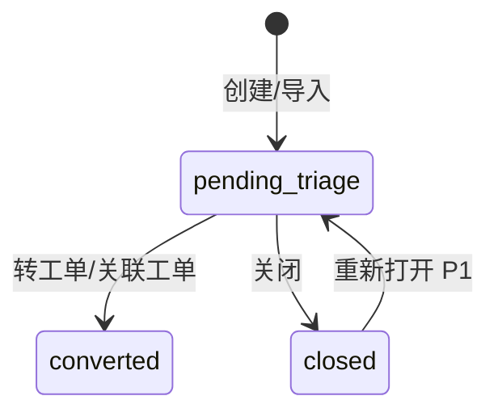
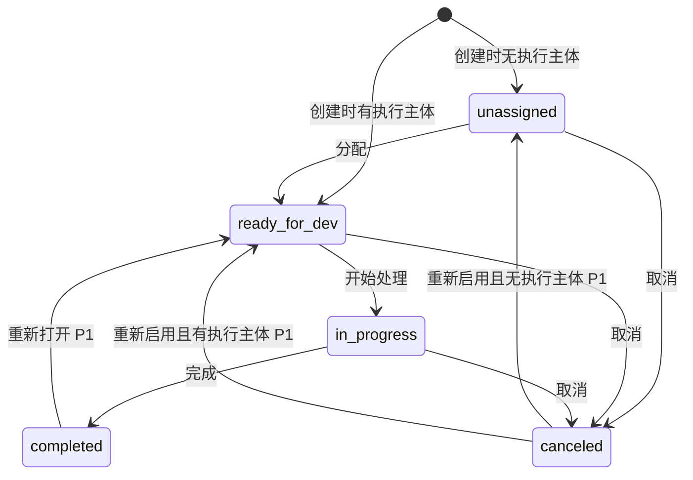

# 状态机设计 - 工单系统 V1.0

> 文档路径：`/Users/estelle/工作-中电2025/07-Workspace/08-projects/工单系统/architecture/状态机设计.md`
>
> 状态：初稿
>
> 更新日期：2026-05-29

---

## 1. 设计目标

状态机设计用于统一管理问题单和工单状态，确保状态流转合法、可追溯、可统计。

核心原则：

1. 问题单和工单使用不同状态机。
2. 问题单不承载研发执行状态。
3. 工单统一使用五状态执行状态机。
4. 只有叶子工单可以手动推进执行状态。
5. 父工单状态由子工单自动计算，P1 支持。
6. 所有状态变更必须记录日志。

---

## 2. 问题单状态机

### 2.1 状态定义

| 状态 | 代码 | 说明 |
|---|---|---|
| 待分流 | pending_triage | 问题单已进入系统，尚未完成分流 |
| 已转工单 | converted | 已转为或关联至少一个工单 |
| 已关闭 | closed | 无需继续处理 |

### 2.2 状态图



### 2.3 流转规则

| 当前状态 | 动作 | 目标状态 | 阶段 | 必填信息 |
|---|---|---|---|---|
| - | 创建问题单 | pending_triage | P0 | 标题、描述 |
| pending_triage | 转业务需求 | converted | P0 | 目标工单 |
| pending_triage | 转技术需求 | converted | P0 | 目标工单 |
| pending_triage | 转缺陷 | converted | P0 | 目标工单 |
| pending_triage | 关联已有工单 | converted | P1 | 目标工单 |
| pending_triage | 关闭 | closed | P0 | 关闭原因 |
| closed | 重新打开 | pending_triage | P1 | 重新打开原因 |

### 2.4 校验规则

- 只有 pending_triage 可以执行分流动作。
- closed 默认不可编辑，需重新打开后编辑。
- converted 不应再次执行 P0 分流动作，P1 可通过追加来源关系扩展。
- 关闭原因必填。
- 重新打开原因必填，P1。

### 2.5 副作用

| 动作 | 副作用 |
|---|---|
| 创建问题单 | 写入 issue_status_log |
| 转工单 | 创建工单、创建来源关系、写入 issue_status_log |
| 关闭 | 写入关闭人、关闭时间、关闭原因、issue_status_log |
| 重新打开 | 清除当前关闭态展示标记但保留历史关闭记录，写入日志 |

---

## 3. 工单状态机

### 3.1 状态定义

| 状态 | 代码 | 说明 |
|---|---|---|
| 待分配 | unassigned | 未指定执行人或团队 |
| 待开发 | ready_for_dev | 已指定执行人或团队，尚未开始 |
| 开发中 | in_progress | 正在处理 |
| 已完成 | completed | 处理完成 |
| 已取消 | canceled | 不再处理 |

### 3.2 状态图



### 3.3 初始状态规则

| 条件 | 初始状态 |
|---|---|
| assignee_id 为空且 team_id 为空 | unassigned |
| assignee_id 不为空或 team_id 不为空 | ready_for_dev |

注意：

- owner_id 不等于执行主体。
- 仅指定负责人但未指定执行人或团队时，仍为 unassigned。

### 3.4 P0 流转规则

| 当前状态 | 动作 | 目标状态 | 必填信息 | 副作用 |
|---|---|---|---|---|
| unassigned | 分配 | ready_for_dev | 执行人或团队 | 记录状态日志 |
| ready_for_dev | 开始处理 | in_progress | - | progress 可设为 1 |
| in_progress | 更新进度 | in_progress | 1-99 进度 | 记录进度日志 |
| in_progress | 完成 | completed | 可选完成说明 | progress=100，completed_at=now |
| unassigned | 取消 | canceled | 取消原因 | canceled_at=now |
| ready_for_dev | 取消 | canceled | 取消原因 | canceled_at=now |
| in_progress | 取消 | canceled | 取消原因 | canceled_at=now |

### 3.5 P1 流转规则

| 当前状态 | 动作 | 目标状态 | 必填信息 | 副作用 |
|---|---|---|---|---|
| completed | 重新打开 | ready_for_dev | 重新打开原因 | progress=0，保留完成历史 |
| canceled | 重新启用 | unassigned | 重新启用原因 | 无执行主体时 |
| canceled | 重新启用 | ready_for_dev | 重新启用原因 | 有执行主体时 |

---

## 4. 叶子工单规则

### 4.1 可手动操作对象

| 对象 | 可手动推进状态 | 可手动更新进度 |
|---|---|---|
| 未拆分工单 | 是 | 是 |
| 子工单 | 是 | 是 |
| 父工单 | 否 | 否 |

### 4.2 进度规则

| 状态 | 进度规则 |
|---|---|
| unassigned | 0，不可手动更新 |
| ready_for_dev | 0，不可手动更新 |
| in_progress | 可手动更新 1-99 |
| completed | 自动 100 |
| canceled | 保留历史进度，但不参与父工单计算 |

---

## 5. 父工单状态计算，P1

### 5.1 状态计算规则

```text
全部取消 => canceled
存在 unassigned => unassigned
不存在 unassigned，存在 ready_for_dev => ready_for_dev
不存在 unassigned/ready_for_dev，存在 in_progress => in_progress
所有未取消子工单 completed => completed
```

### 5.2 示例

| 子工单状态 | 父工单状态 |
|---|---|
| unassigned + in_progress | unassigned |
| ready_for_dev + completed | ready_for_dev |
| in_progress + completed | in_progress |
| completed + completed | completed |
| canceled + completed | completed |
| canceled + canceled | canceled |

### 5.3 触发时机

- 子工单创建后。
- 子工单状态变化后。
- 子工单取消后。
- 子工单重新打开后。
- 子工单重新启用后。

---

## 6. 父工单进度计算，P1

### 6.1 默认计算

```text
父工单进度 = 参与计算子工单进度之和 / 参与计算子工单数量
```

### 6.2 子工单参与规则

| 子工单状态 | 是否参与 | 进度 |
|---|---|---|
| unassigned | 是 | 0 |
| ready_for_dev | 是 | 0 |
| in_progress | 是 | 实际进度 |
| completed | 是 | 100 |
| canceled | 否 | 不参与 |

### 6.3 特殊情况

- 全部子工单 canceled：父工单进度为 0，状态为 canceled。
- 无子工单：不是父工单，按叶子工单规则处理。

---

## 7. 状态机服务接口

### 7.1 核心方法

```text
validateTransition(entityType, currentStatus, action, context)
applyTransition(entityType, entityId, action, payload, operator)
recordStatusLog(entityType, entityId, fromStatus, toStatus, operator, reason)
```

### 7.2 工单动作定义

| 动作 | 说明 |
|---|---|
| assign | 分配 |
| start | 开始处理 |
| update_progress | 更新进度 |
| complete | 完成 |
| cancel | 取消 |
| reopen | 重新打开，P1 |
| reactivate | 重新启用，P1 |

---

## 8. 并发与幂等

1. 状态变更需校验当前状态，避免并发覆盖。
2. 转工单操作需使用幂等键，避免重复点击创建重复工单。
3. 完成、取消等动作重复提交时，若状态已变化，应返回当前状态而非重复写入。
4. 可以使用 version 字段或 updated_at 乐观锁控制并发。

---

## 9. 后续细化

1. 设计状态机错误码。
2. 设计每个动作的请求参数和响应结构。
3. 明确父工单重算是同步还是异步。
4. 明确状态日志是否记录系统计算动作。

