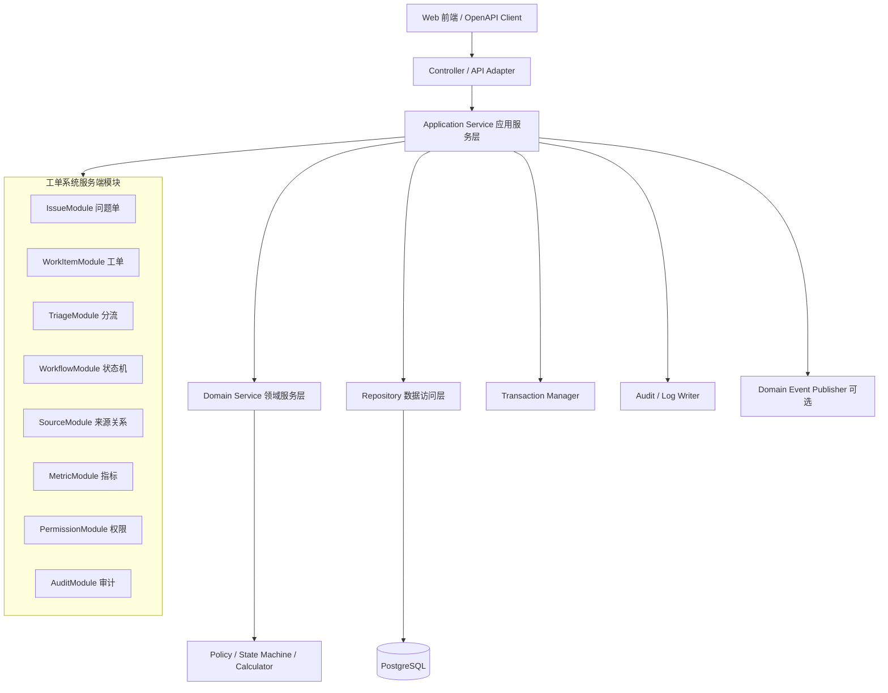
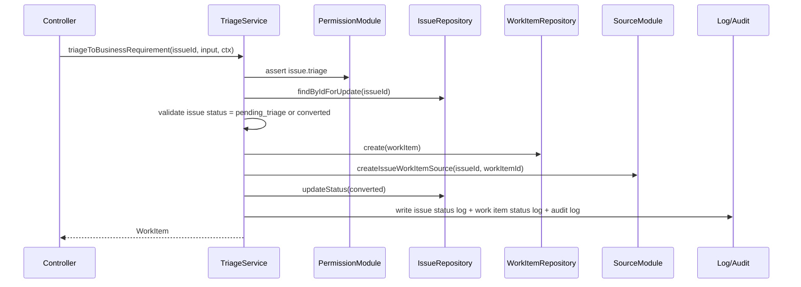
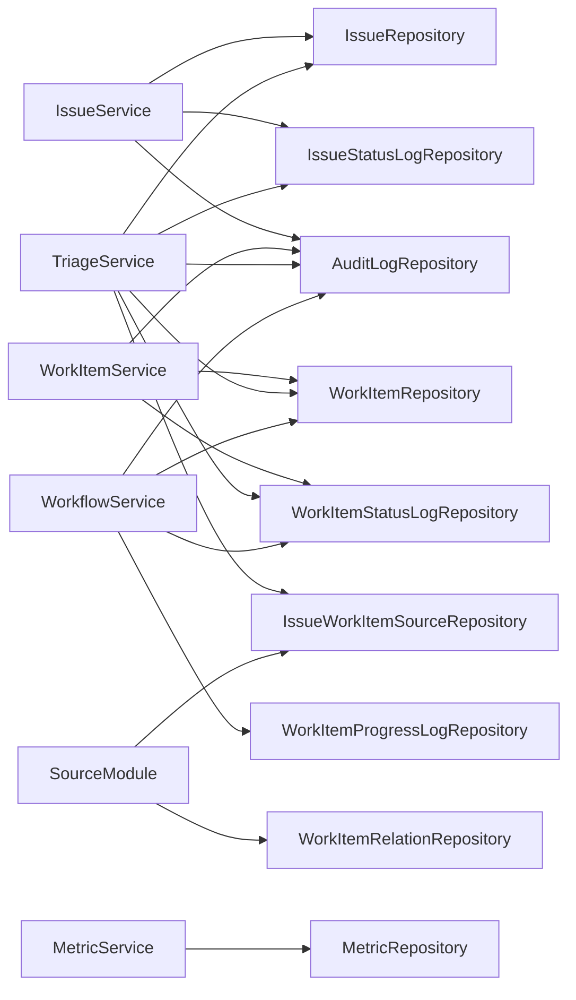

# 服务端模块设计 - 工单系统 V1.0

> 文档路径：`/Users/estelle/工作-中电2025/07-Workspace/08-projects/工单系统/development/服务端模块设计.md`
>
> 状态：初稿
>
> 更新日期：2026-05-30
>
> 上游依据：`PRD/P0-MVP-范围冻结稿.md`、`architecture/架构设计.md`、`architecture/数据模型.md`、`architecture/状态机设计.md`、`architecture/接口设计.md`、`architecture/openapi/P0-openapi.yaml`

---

## 1. 设计目标

本文档定义工单系统服务端的模块边界、分层职责、核心事务、领域规则落点和 Repository 依赖关系，目标是让后续代码实现可以按模块独立推进，并保持 P0 独立闭环与 P1/P2/P3 扩展之间的清晰边界。

P0 服务端需要支撑：

1. 问题单手动创建、编辑、列表、详情、关闭。
2. 问题单人工分流为业务需求、技术需求、缺陷。
3. 工单手动创建、编辑、列表、详情。
4. 叶子工单执行状态机：分配、开始、更新进度、完成、取消。
5. 来源追溯：问题单与工单 n:n 来源关系。
6. 基础统计：问题单状态、工单分类、工单状态、叶子工单数量。
7. 权限、审计、状态日志、进度日志。

P1 预留：

- 工单二级拆分与父工单计算。
- 缺陷转需求，并记录来源缺陷。
- 个人视图、团队视图与个人视图转团队。
- AI 自然语言创建工单。

P3 预留：

- AI 智能问题单分流。
- GienCoder 智能软件工厂联动。

---

## 2. 服务端分层架构



### 2.1 Controller / API Adapter

职责：

- 承接 OpenAPI 定义的 HTTP 请求。
- 做请求参数解析、基础格式校验、分页/排序参数归一化。
- 构造 `RequestContext`，包含用户、团队、角色、requestId、idempotencyKey。
- 调用应用服务，不直接访问 Repository。
- 将领域错误转换为统一错误响应。

不应承担：

- 不写状态机判断。
- 不写来源关系创建逻辑。
- 不写事务编排。
- 不写父工单计算规则。

### 2.2 Application Service

职责：

- 按业务用例组织流程。
- 管理事务边界。
- 调用权限服务、领域服务和 Repository。
- 保证多表写入的一致性。
- 写入审计日志、状态日志、进度日志。
- 处理幂等键与并发冲突。

典型应用服务：

- `IssueService`
- `WorkItemService`
- `TriageService`
- `WorkflowService`
- `MetricService`
- `ViewConfigService`（P0.2/P1）
- `AiCreationService`（P1）

### 2.3 Domain Service / Policy

职责：

- 封装纯业务规则，尽量无 I/O。
- 状态机校验。
- 初始状态计算。
- 叶子工单校验。
- 父工单状态和进度计算。
- 字段不可变规则校验。
- 指标口径计算规则。

典型领域服务：

- `StatusMachineService`
- `WorkItemHierarchyPolicy`
- `ParentWorkItemCalculator`
- `WorkItemCreationPolicy`
- `IssueTriagePolicy`
- `MetricCalculator`

### 2.4 Repository

职责：

- 封装数据库读写。
- 提供面向领域对象的持久化接口。
- 支持事务上下文 `TransactionContext`。
- 负责查询条件映射、分页、排序和锁查询。
- 不承载业务状态机和跨表事务编排。

详细接口骨架见：`development/code-skeleton/repository-interfaces.ts`。

---

## 3. 模块总览

| 模块 | 阶段 | 核心职责 | 主要依赖 |
|---|---|---|---|
| IssueModule | P0 | 问题单创建、编辑、查询、关闭、状态日志 | IssueRepository、IssueStatusLogRepository、PermissionModule、AuditModule |
| WorkItemModule | P0 | 工单创建、编辑、查询、详情、叶子判断 | WorkItemRepository、WorkItemStatusLogRepository、PermissionModule、AuditModule |
| TriageModule | P0 | 问题单人工分流为业务需求/技术需求/缺陷 | IssueRepository、WorkItemRepository、IssueWorkItemSourceRepository、SourceModule、WorkflowModule |
| WorkflowModule | P0 | 工单状态动作与进度更新 | WorkItemRepository、WorkItemStatusLogRepository、WorkItemProgressLogRepository |
| SourceModule | P0/P1 | 问题单-工单来源关系、缺陷转需求关系 | IssueWorkItemSourceRepository、WorkItemRelationRepository |
| MetricModule | P0/P2 | 基础统计与后续高级统计 | MetricRepository、PermissionModule |
| PermissionModule | P0 | 操作权限、数据范围、目标对象权限 | User/Team 数据源、业务 Repository |
| AuditModule | P0 | 操作审计日志写入与查询 | AuditLogRepository |
| ViewConfigModule | P0.2/P1 | 个人/团队视图配置、个人视图转团队 | ViewConfigRepository、PermissionModule |
| AiCreationModule | P1 | 自然语言创建工单草稿、确认创建 | AiCreationRecordRepository、WorkItemModule |
| AiTriageModule | P3 | AI 问题单分流建议 | AiTriageSuggestionRepository、TriageModule |

---

## 4. 核心模块设计

## 4.1 IssueModule 问题单模块

### 职责

- 创建问题单。
- 编辑未关闭问题单。
- 查询问题单列表与详情。
- 关闭问题单。
- 写入问题单状态日志。
- 提供分流模块所需的问题单读取与锁定能力。

### 关键规则

1. 新建问题单默认状态为 `pending_triage`。
2. 问题单可手动创建，也可由后续批量导入创建。
3. `closed` 状态必须有关闭原因或关闭原因类型。
4. 已关闭问题单不可直接分流，需要先重新打开；P0 如未实现重新打开，则提示状态不允许。
5. 问题单不是研发执行载体，不支持执行人、进度、开发状态。
6. 问题单转工单成功后状态进入 `converted`。
7. 问题单与工单为 n:n，因此 `converted` 不代表只能有一个关联工单。

### 主要用例

| 用例 | 方法 | 事务 | 说明 |
|---|---|---|---|
| 创建问题单 | `createIssue` | 是 | 插入 issue，写审计日志 |
| 编辑问题单 | `updateIssue` | 是 | 校验状态，更新字段，写审计日志 |
| 问题单列表 | `listIssues` | 否 | 结合数据范围查询 |
| 问题单详情 | `getIssue` | 否 | 查询基础信息、状态日志、关联工单 |
| 关闭问题单 | `closeIssue` | 是 | 状态流转、写状态日志、写审计日志 |

### 输入输出

- 输入：`CreateIssueInput`、`UpdateIssueInput`、`CloseIssueInput`、`IssueQuery`。
- 输出：`Issue`、`PageResult<Issue>`、问题单详情 DTO。

---

## 4.2 WorkItemModule 工单模块

### 职责

- 手动创建业务需求、技术需求、缺陷。
- 编辑工单基础字段。
- 查询工单列表与详情。
- 维护工单初始状态。
- 为 P1 工单拆分和缺陷转需求预留扩展。

### 关键规则

1. 工单类型只允许：`business_requirement`、`technical_requirement`、`defect`。
2. 手动创建时 `source_type = manual`。
3. 问题单分流创建时 `source_type = issue_converted`。
4. 缺陷转需求创建时 `source_type = defect_to_requirement`，并记录 `source_defect_id` 和 `work_item_relation`。
5. AI 创建确认后 `source_type = ai_created`，并记录 `ai_creation_id`。
6. 初始状态只看执行主体：有 `assignee_id` 或 `team_id` 为 `ready_for_dev`，否则为 `unassigned`；`owner_id` 不算执行主体。
7. P0 中创建的工单均为叶子工单：`level = 1`、`is_leaf = true`、`parent_id = null`。
8. 普通编辑不可修改 `type`、`source_type`、`source_defect_id`、`ai_creation_id`。
9. 非叶子工单不能作为研发执行载体，P1 开始由 WorkflowModule 拦截执行动作。

### 主要用例

| 用例 | 方法 | 事务 | 说明 |
|---|---|---|---|
| 手动创建工单 | `createWorkItem` | 是 | 插入工单，写初始状态日志，写审计日志 |
| 编辑工单 | `updateWorkItem` | 是 | 校验不可变字段和状态，更新基础字段 |
| 工单列表 | `listWorkItems` | 否 | 支持类型、状态、执行人、团队、叶子等筛选 |
| 工单详情 | `getWorkItem` | 否 | 查询基础信息、来源、日志、父子关系 |

---

## 4.3 TriageModule 分流模块

### 职责

- 将问题单人工转为业务需求。
- 将问题单人工转为技术需求。
- 将问题单人工转为缺陷。
- 在同一事务内维护工单、来源关系、问题单状态和日志。

### 核心事务



### 关键规则

1. 分流必须使用事务。
2. 分流成功必须创建 `issue_work_item_source`。
3. 分流成功后问题单状态置为 `converted`。
4. 因为问题单与工单是 n:n，已 `converted` 的问题单后续可继续关联或合并来源；P0 可先限制为人工转入，P1 扩展关联已有工单。
5. 分流创建工单的初始状态规则与手动创建一致。
6. 同一问题单和同一工单的来源关系不可重复。
7. 需要支持幂等键，避免重复点击导致重复创建工单。

---

## 4.4 WorkflowModule 状态机模块

### 职责

- 分配工单。
- 开始开发。
- 更新进度。
- 完成工单。
- 取消工单。
- 写入状态日志和进度日志。
- 校验叶子工单执行规则。

### 状态动作

| 动作 | 起始状态 | 目标状态 | 附加规则 |
|---|---|---|---|
| assign | `unassigned` / `ready_for_dev` / `in_progress` | `ready_for_dev` | 必须有 assignee 或 team |
| start | `ready_for_dev` | `in_progress` | 仅叶子工单 |
| updateProgress | `ready_for_dev` / `in_progress` | 原状态不变 | P0 手动进度 1-99；完成动作置 100 |
| complete | `ready_for_dev` / `in_progress` | `completed` | 自动 progress=100，写完成时间 |
| cancel | `unassigned` / `ready_for_dev` / `in_progress` | `canceled` | 必须有取消原因 |
| reopen | P1 可选 | 取决于执行主体 | P0 暂不暴露或仅内部预留 |

### 叶子约束

- `is_leaf = true` 的工单才允许分配、开始、更新进度、完成、取消。
- P0 所有工单默认是叶子工单。
- P1 父工单在看板中可展示为关联项，但不可作为执行动作目标。

### 日志规则

1. 状态变化必须写入 `work_item_status_log`。
2. 进度变化必须写入 `work_item_progress_log`。
3. 完成动作同时写入状态日志和进度日志。
4. 分配动作如果状态未变化，仍建议写审计日志；是否写状态日志由实现统一约定。

---

## 4.5 SourceModule 来源关系模块

### 职责

- 维护问题单与工单的 n:n 来源关系。
- 查询工单来源问题单。
- 查询问题单关联工单。
- P1 维护缺陷转需求的工单间关系。

### 来源关系

| 来源类型 | 主表字段 | 关系表 | 阶段 |
|---|---|---|---|
| 问题单转入 | `work_item.source_type = issue_converted` | `issue_work_item_source` | P0 |
| 人为创建 | `work_item.source_type = manual` | 无强制关系 | P0 |
| 缺陷转需求 | `work_item.source_type = defect_to_requirement`、`source_defect_id` | `work_item_relation` | P1 |
| AI 创建 | `work_item.source_type = ai_created`、`ai_creation_id` | `ai_creation_record` | P1 |

### 关键规则

1. 来源类型不可通过普通编辑修改。
2. 删除采用软删除，避免破坏来源追溯。
3. 来源关系用于详情页、审计、指标统计和后续 GienCoder 联动。
4. 缺陷转需求时，来源工单必须是缺陷，目标工单必须是业务需求或技术需求。

---

## 4.6 MetricModule 指标模块

### 职责

- 提供 P0 基础统计。
- 支持按数据范围、团队、时间过滤。
- 后续扩展周期、效率、负载、超期、转化率等高级统计。

### P0 指标

| 指标 | 口径 | 数据源 |
|---|---|---|
| 问题单总数 | 未删除 issue 数 | issue |
| 待分流问题数 | `status = pending_triage` | issue |
| 已转工单问题数 | `status = converted` | issue |
| 已关闭问题数 | `status = closed` | issue |
| 工单总数 | 未删除 work_item 数 | work_item |
| 叶子工单数 | `is_leaf = true` | work_item |
| 父工单数 | `is_leaf = false` | work_item |
| 工单分类统计 | 按 `type` 聚合 | work_item |
| 工单状态统计 | 按 `status` 聚合 | work_item |

### 查询策略

- P0 可直接通过聚合 SQL 实时计算。
- P2 若数据量增长，可增加统计快照表或物化视图。
- 所有指标必须先应用 PermissionModule 生成的数据范围。

---

## 4.7 PermissionModule 权限模块

### 职责

- 操作权限校验。
- 数据范围生成。
- 目标对象权限校验。
- 为列表、详情、统计提供一致的数据访问边界。

### P0 建议权限动作

| 动作 | 说明 |
|---|---|
| `issue.create` | 创建问题单 |
| `issue.update` | 编辑问题单 |
| `issue.close` | 关闭问题单 |
| `issue.triage` | 分流问题单 |
| `work_item.create` | 手动创建工单 |
| `work_item.update` | 编辑工单 |
| `work_item.assign` | 分配工单 |
| `work_item.execute` | 开始、更新进度、完成 |
| `work_item.cancel` | 取消工单 |
| `metric.read` | 查看指标 |

### 数据范围

- 管理员：可查看全部。
- 团队负责人：可查看所属团队相关问题单和工单。
- 普通成员：可查看自己创建、提交、负责、执行或所属团队可见的数据。

---

## 4.8 AuditModule 审计模块

### 职责

- 写入关键操作审计日志。
- 统一审计动作命名。
- 保存操作前后关键字段变化。
- 支撑详情页动态、问题追踪和后续合规审计。

### P0 审计动作

| 动作 | 触发场景 |
|---|---|
| `issue.created` | 创建问题单 |
| `issue.updated` | 编辑问题单 |
| `issue.closed` | 关闭问题单 |
| `issue.triaged` | 问题单转工单 |
| `work_item.created` | 创建工单 |
| `work_item.updated` | 编辑工单 |
| `work_item.assigned` | 分配工单 |
| `work_item.started` | 开始开发 |
| `work_item.progress_updated` | 更新进度 |
| `work_item.completed` | 完成工单 |
| `work_item.canceled` | 取消工单 |

---

## 5. 核心事务设计

## 5.1 问题单转工单

### 事务步骤

1. 校验 `issue.triage` 权限。
2. 根据 `issueId` 加锁读取问题单。
3. 校验问题单状态允许分流。
4. 根据目标类型构造工单数据。
5. 计算工单初始状态。
6. 插入 `work_item`。
7. 插入 `issue_work_item_source`。
8. 更新问题单状态为 `converted`。
9. 插入问题单状态日志。
10. 插入工单初始状态日志。
11. 插入审计日志。
12. 提交事务并返回工单。

### 失败回滚

任一步失败，必须回滚全部写入，避免出现“有工单但无来源关系”或“问题单已转但无工单”的不一致状态。

## 5.2 手动创建工单

### 事务步骤

1. 校验 `work_item.create` 权限。
2. 校验工单类型、必填字段和类型专属字段。
3. 设置 `source_type = manual`。
4. 计算初始状态。
5. P0 设置 `level = 1`、`is_leaf = true`。
6. 插入工单。
7. 插入工单初始状态日志。
8. 插入审计日志。
9. 返回工单。

## 5.3 状态机动作

### 事务步骤

1. 校验对应动作权限。
2. 加锁读取工单。
3. 校验工单存在且未删除。
4. 校验 `is_leaf = true`。
5. 校验状态机流转。
6. 校验动作参数，如取消原因、进度范围。
7. 更新工单状态、进度和时间字段。
8. 插入状态日志和/或进度日志。
9. 插入审计日志。
10. P1 如有父工单，触发父工单重新计算。

## 5.4 P1 工单拆分

P1 新增事务：

1. 加锁读取父候选工单。
2. 校验候选工单为一级工单。
3. 校验候选工单当前可以拆分。
4. 创建二级子工单列表。
5. 将父工单置为 `is_leaf = false`。
6. 父工单状态和进度改由子工单计算。
7. 写入审计日志。

### 父工单计算规则

进度：

- 默认对子工单等权平均。
- 已取消子工单默认不参与计算。
- 全部子工单取消时，父工单状态为 `canceled`，进度为 0%。

状态：

```text
全部取消 => canceled
存在 unassigned => unassigned
不存在 unassigned，存在 ready_for_dev => ready_for_dev
不存在 unassigned/ready_for_dev，存在 in_progress => in_progress
所有未取消子工单 completed => completed
```

## 5.5 P1 缺陷转需求

事务步骤：

1. 校验来源工单存在、是叶子工单、类型为 `defect`。
2. 校验用户有缺陷转需求权限。
3. 创建目标业务需求或技术需求。
4. 设置 `source_type = defect_to_requirement`。
5. 设置 `source_defect_id = 来源缺陷 ID`。
6. 插入 `work_item_relation`，类型为 `defect_to_requirement`。
7. 写入审计日志。

---

## 6. 幂等与并发

## 6.1 幂等键

写操作可通过 `Idempotency-Key` 处理重复提交。

P0 必须优先覆盖：

- 问题单转工单。
- 手动创建工单。
- 状态机动作，尤其完成和取消。

建议实现方式：

- 新增通用幂等记录表，或使用框架中间件记录 requestId + idempotencyKey + userId + response hash。
- P0 如果暂不建表，至少对分流来源关系做唯一约束，并在冲突时返回明确错误。

## 6.2 并发控制

关键写流程使用行级锁：

- `findIssueByIdForUpdate`
- `findWorkItemByIdForUpdate`

关键唯一约束：

- `issue.issue_no`
- `work_item.work_item_no`
- `issue_work_item_source(issue_id, work_item_id)`
- `work_item_relation(source_work_item_id, target_work_item_id, relation_type)`

---

## 7. 错误处理

| 错误码 | 触发场景 | HTTP 建议 |
|---|---|---|
| `VALIDATION_ERROR` | 参数缺失、格式错误、类型专属字段不合法 | 400 |
| `UNAUTHORIZED` | 未登录 | 401 |
| `FORBIDDEN` | 无权限或超出数据范围 | 403 |
| `NOT_FOUND` | 对象不存在或已删除 | 404 |
| `CONFLICT` | 并发冲突、重复提交、唯一约束冲突 | 409 |
| `ISSUE_STATUS_INVALID` | 问题单状态不允许当前动作 | 409 |
| `WORK_ITEM_STATUS_INVALID` | 工单状态不允许当前动作 | 409 |
| `WORK_ITEM_NOT_LEAF` | 非叶子工单执行状态机动作 | 409 |
| `SOURCE_RELATION_FAILED` | 来源关系创建或校验失败 | 409 |
| `INTERNAL_ERROR` | 未预期系统异常 | 500 |

错误处理原则：

1. 领域错误使用稳定错误码，不直接暴露数据库错误。
2. 事务内错误必须整体回滚。
3. 幂等重复请求应尽可能返回首次成功结果；无法返回时返回 `CONFLICT` 和可理解提示。
4. 权限错误不泄漏用户无权查看对象的详细信息。

---

## 8. Repository 依赖关系



Repository 实现注意事项：

- 查询方法默认排除 `deleted_at is not null` 的记录。
- 所有写方法接受可选 `TransactionContext`。
- 列表查询必须显式支持分页，禁止无上限全量查询。
- Repository 不应依赖 HTTP 层对象。
- Repository 不做权限判断，只接受服务层传入的数据范围或过滤条件。

---

## 9. DTO 与领域对象边界

建议在实现中区分：

| 类型 | 说明 |
|---|---|
| API DTO | 与 OpenAPI 请求/响应对齐，用于 Controller |
| Application Input | 与服务接口对齐，用于用例入参 |
| Domain Entity | 与 `domain-types.ts` 对齐，表达核心实体 |
| Persistence Record | 与数据库字段对齐，通常为 snake_case 或 ORM Entity |
| Query View | 列表/详情聚合视图，包含关联数量、展示名称等 |

转换方向：

```text
API DTO -> Application Input -> Domain Entity -> Persistence Record
Persistence Record -> Domain Entity -> Query View / API Response
```

---

## 10. P0 实现顺序建议

1. 工程基础：错误模型、请求上下文、事务管理、Repository 基类。
2. IssueModule：创建、编辑、列表、详情、关闭。
3. WorkItemModule：创建、编辑、列表、详情、初始状态。
4. SourceModule：问题单-工单来源关系。
5. TriageModule：问题单转三类工单。
6. WorkflowModule：分配、开始、进度、完成、取消。
7. MetricModule：基础统计。
8. PermissionModule 与 AuditModule 的最小可用版本。
9. API 集成与 E2E 主链路测试。

---

## 11. P1/P2/P3 扩展点

### P1

- `WorkItemHierarchyService`：二级拆分、父工单计算。
- `DefectConversionService`：缺陷转需求。
- `ViewConfigService`：个人视图、团队视图、个人转团队。
- `AiCreationService`：自然语言生成工单草稿并确认创建。

### P2

- `AdvancedMetricService`：周期、吞吐、负载、超期、趋势。
- `ExportService`：列表和指标导出。
- `NotificationService`：超期提醒、状态订阅。

### P3

- `AiTriageService`：问题单智能分流建议。
- `GienCoderIntegrationService`：把叶子工单作为研发执行载体，与 GienCoder 开发任务打通。

---

## 12. 服务端完成性清单

P0 服务端实现完成时，应满足：

- [ ] 问题单可以手动创建、编辑、查询和关闭。
- [ ] 问题单可以人工分流为业务需求、技术需求、缺陷。
- [ ] 分流事务能同时写入工单、来源关系、问题单状态、状态日志和审计日志。
- [ ] 工单可以手动创建、编辑、查询。
- [ ] 工单初始状态按执行主体计算。
- [ ] 只有叶子工单可执行状态动作。
- [ ] 状态动作遵循状态机并写入日志。
- [ ] 基础指标统计与列表数据范围一致。
- [ ] Repository 层接口与数据库 DDL、OpenAPI 口径一致。
- [ ] 关键写操作具备事务保护和并发冲突处理。
