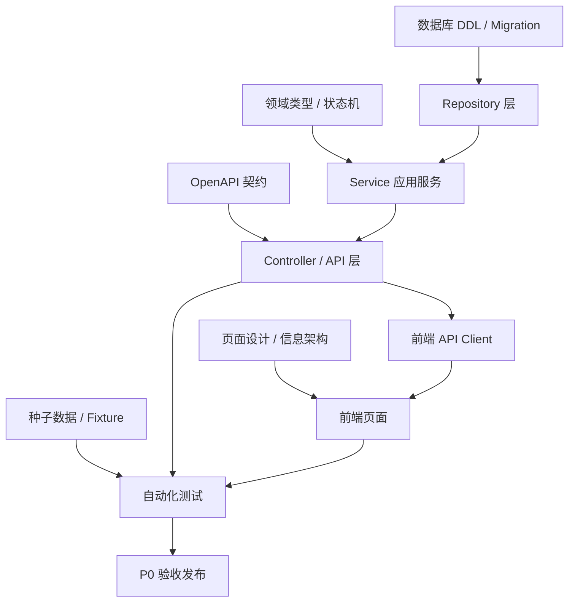

# 端到端开发实施计划 - 工单系统 P0

> 文档路径：`/Users/estelle/工作-中电2025/07-Workspace/08-projects/工单系统/development/端到端开发实施计划.md`
>
> 状态：初稿
>
> 更新日期：2026-05-30
>
> 目标：把前端、后端、数据库、测试串成可执行迭代，支撑从代码工程初始化到 P0 独立闭环验收。

---

## 1. 实施目标

P0 目标不是一次性做完完整工单平台，而是交付一个可运行、可验证、可追溯的独立闭环：

```text
问题单创建/编辑/查看
  -> 待分流问题池
  -> 人工转业务需求/技术需求/缺陷
  -> 工单来源追溯
  -> 叶子工单状态流转
  -> 工单列表与详情
  -> 基础统计
  -> 自动化测试验收
```

实施计划遵循四个原则：

1. **契约先行**：DDL、OpenAPI、领域类型先稳定，再并行前后端。
2. **纵切优先**：每个迭代都尽量交付一条可运行链路，而不是只做横向层。
3. **测试前置**：每个迭代都有单元、集成或 E2E 验收点。
4. **渐进增强**：P0 只做独立闭环；P1/P2/P3 扩展点预留但不抢跑。

---

## 2. 上游输入与产物关系

| 输入文档 | 用途 |
|---|---|
| `PROJECT.md` | 项目入口、关键口径、分期范围 |
| `PRD/P0-MVP-范围冻结稿.md` | P0 范围边界与验收依据 |
| `architecture/数据模型.md` | 数据实体、字段、枚举、关系 |
| `architecture/sql/P0-schema-postgresql.sql` | 数据库建表与索引依据 |
| `architecture/openapi/P0-openapi.yaml` | 前后端接口契约 |
| `architecture/状态机设计.md` | 问题单与工单状态流转规则 |
| `architecture/权限模型.md` | 操作权限与数据范围 |
| `development/服务端模块设计.md` | 后端模块边界、事务和 Repository 依赖 |
| `development/code-skeleton/*.ts` | TypeScript 类型、服务接口、Repository 接口骨架 |
| `design/前端页面设计与信息架构.md` | 页面、导航、交互和信息展示依据 |
| `testing/P0-测试方案.md` | 主链路、异常链路、权限和统计验收依据 |

---

## 3. 推荐工程形态

如无既有约束，建议采用一个 monorepo，便于前后端共享类型与 OpenAPI 产物。

```text
work-order-system/
├── apps/
│   ├── web/                     # 前端应用
│   └── api/                     # 后端 API 服务
├── packages/
│   ├── contracts/               # OpenAPI、生成的 API 类型、共享 DTO
│   ├── domain/                  # 领域枚举、状态机纯函数、共享类型
│   └── test-fixtures/           # 测试数据工厂
├── db/
│   ├── migrations/              # 数据库迁移
│   ├── seeds/                   # 本地/测试种子数据
│   └── schema/                  # DDL 草案或快照
├── tests/
│   ├── api/                     # API 集成测试
│   └── e2e/                     # 浏览器 E2E 测试
├── docs/                        # 项目开发文档，可同步 08-projects 文档摘要
├── package.json
├── pnpm-workspace.yaml
└── README.md
```

如果后端选择 Java / Spring Boot，也可保留相同理念：

```text
work-order-system/
├── frontend/                    # 前端应用
├── backend/                     # Spring Boot 服务
├── contracts/                   # OpenAPI 契约
├── db/                          # migration / seeds
└── tests/                       # E2E 与契约测试
```

---

## 4. 端到端交付地图



---

## 5. 迭代分解总览

| 迭代 | 名称 | 建议周期 | 交付目标 | 验收方式 |
|---|---|---:|---|---|
| Iteration 0 | 工程与契约基线 | 2-3 天 | 项目可启动、数据库可迁移、OpenAPI/类型可使用 | 本地启动 + migration + lint/test 通过 |
| Iteration 1 | 问题单最小闭环 | 3-5 天 | 问题单创建、编辑、列表、详情、关闭 | API 集成测试 + 前端冒烟 |
| Iteration 2 | 工单基础闭环 | 3-5 天 | 手动创建三类工单、列表、详情、编辑 | API 集成测试 + 页面验收 |
| Iteration 3 | 分流与来源追溯 | 4-6 天 | 问题单转三类工单，来源双向追溯 | 事务测试 + E2E 主链路 |
| Iteration 4 | 状态机与进度跟踪 | 4-6 天 | 分配、开始、进度、完成、取消 | 状态机单测 + API/E2E |
| Iteration 5 | 工作台、筛选与统计 | 3-5 天 | 工作台、基础筛选、指标总览 | 统计口径测试 + UI 验收 |
| Iteration 6 | 权限、审计与验收加固 | 3-5 天 | 数据范围、审计日志、异常回归、P0 验收 | 全量回归 + 验收清单 |

> 注：若团队较小，可合并 Iteration 1/2；若前后端并行，可在 Iteration 0 后按接口契约同步推进。

---

## 6. Iteration 0：工程与契约基线

### 6.1 目标

建立可持续开发的基础，让后续每个功能都能被迁移、启动、测试和验证。

### 6.2 后端任务

- 初始化 API 工程。
- 建立统一错误模型和响应结构。
- 接入请求上下文：`userId`、`teamIds`、`roles`、`requestId`、`idempotencyKey`。
- 配置数据库连接。
- 建立 migration 机制。
- 将 `architecture/sql/P0-schema-postgresql.sql` 转为首个 migration。
- 导入 `domain-types.ts`、`service-interfaces.ts`、`repository-interfaces.ts` 到工程。
- 实现基础健康检查接口：`GET /health`。

### 6.3 前端任务

- 初始化 Web 工程。
- 建立路由框架和基础布局。
- 建立 API client 目录。
- 建立统一错误提示、空状态、加载状态组件。
- 建立导航骨架：工作台、问题单、工单、统计。
- 准备 Mock 数据或接入 OpenAPI mock server。

### 6.4 数据库任务

- 创建本地数据库。
- 执行 P0 核心表 migration。
- 准备基础种子数据：用户、团队、角色。
- 准备测试环境重置脚本。

### 6.5 测试任务

- 配置单元测试框架。
- 配置 API 集成测试框架。
- 配置 E2E 测试框架。
- 增加最小冒烟测试：健康检查、数据库连接、前端首页加载。

### 6.6 验收标准

- [ ] 本地一条命令可启动前端和后端。
- [ ] 数据库 migration 可从空库执行成功。
- [ ] 种子数据可重复导入。
- [ ] lint / typecheck / unit test 命令可运行。
- [ ] 前端可打开基础导航页面。
- [ ] 后端 `GET /health` 正常。

---

## 7. Iteration 1：问题单最小闭环

### 7.1 用户价值

用户可以把需求线索或缺陷线索录入系统，并由分流角色查看、编辑和关闭。

### 7.2 后端任务

- 实现 `IssueRepository`。
- 实现 `IssueStatusLogRepository`。
- 实现 `IssueService`：
  - `createIssue`
  - `updateIssue`
  - `listIssues`
  - `getIssue`
  - `closeIssue`
- 实现问题单状态校验：`pending_triage`、`converted`、`closed`。
- 写入基础审计日志。
- 按 OpenAPI 暴露：
  - `POST /api/issues`
  - `PUT /api/issues/{issueId}`
  - `GET /api/issues`
  - `GET /api/issues/{issueId}`
  - `POST /api/issues/{issueId}/close`

### 7.3 前端任务

- 新建问题单页。
- 编辑问题单页。
- 问题单列表页。
- 待分流问题池列表。
- 问题单详情页。
- 关闭问题单弹窗。
- 列表筛选：关键词、状态、线索类型、优先级、提交人、创建时间。

### 7.4 数据库任务

- 校验 `issue` 表索引和约束。
- 校验 `issue_status_log` 写入。
- 校验 `audit_log` 写入。

### 7.5 测试任务

- 单测：问题单状态流转校验。
- API 集成测试：创建、编辑、列表、详情、关闭。
- 异常测试：标题为空、描述为空、关闭原因为空、编辑已关闭问题单。
- 前端冒烟：创建问题单后列表可见，关闭后状态变化。

### 7.6 验收标准

- [ ] 可以手动创建问题单。
- [ ] 可以编辑待分流问题单。
- [ ] 已关闭问题单不可编辑。
- [ ] 问题单列表筛选正确。
- [ ] 问题单详情展示基础信息、状态日志和关闭信息。
- [ ] 关闭问题单必须填写关闭原因。

---

## 8. Iteration 2：工单基础闭环

### 8.1 用户价值

产品、技术或测试人员可以不依赖问题单，直接创建业务需求、技术需求和缺陷工单。

### 8.2 后端任务

- 实现 `WorkItemRepository`。
- 实现 `WorkItemStatusLogRepository`。
- 实现 `WorkItemService`：
  - `createWorkItem`
  - `updateWorkItem`
  - `listWorkItems`
  - `getWorkItem`
- 实现初始状态计算：
  - 有 `assigneeId` 或 `teamId` => `ready_for_dev`
  - 无执行主体 => `unassigned`
- 创建时默认：`source_type = manual`、`level = 1`、`is_leaf = true`。
- 普通编辑禁止修改：`type`、`source_type`、`source_defect_id`、`ai_creation_id`。
- 暴露：
  - `POST /api/work-items`
  - `PUT /api/work-items/{workItemId}`
  - `GET /api/work-items`
  - `GET /api/work-items/{workItemId}`

### 8.3 前端任务

- 新建工单页，支持选择：业务需求、技术需求、缺陷。
- 按工单类型展示差异字段：
  - 业务需求：业务分类、验收标准。
  - 技术需求：技术分类、完成标准、风险说明。
  - 缺陷：严重程度、期望结果、实际结果、复现步骤、影响范围。
- 工单列表页。
- 我的工单入口。
- 工单详情页。
- 编辑工单页。

### 8.4 数据库任务

- 校验 `work_item` 表约束。
- 校验工单编号唯一。
- 校验状态日志写入。

### 8.5 测试任务

- 单测：初始状态计算。
- API 集成测试：手动创建三类工单。
- API 集成测试：工单列表筛选和详情。
- 异常测试：非法工单类型、修改不可变字段。
- 前端冒烟：三类工单创建后可在列表与详情查看。

### 8.6 验收标准

- [ ] 三类工单均可手动创建。
- [ ] 无执行主体的工单状态为待分配。
- [ ] 有执行主体的工单状态为待开发。
- [ ] 工单详情展示类型专属字段。
- [ ] 普通编辑不能改变工单类型和来源类型。

---

## 9. Iteration 3：分流与来源追溯

### 9.1 用户价值

分流处理人可以把问题单转为业务需求、技术需求或缺陷，并保留来源追溯关系。

### 9.2 后端任务

- 实现 `IssueWorkItemSourceRepository`。
- 实现 `SourceModule` P0 能力。
- 实现 `TriageService`：
  - `triageToBusinessRequirement`
  - `triageToTechnicalRequirement`
  - `triageToDefect`
- 分流事务包含：
  - 加锁读取问题单。
  - 创建工单。
  - 创建来源关系。
  - 更新问题单状态为 `converted`。
  - 写问题单状态日志。
  - 写工单状态日志。
  - 写审计日志。
- 支持 `Idempotency-Key`。
- 暴露：
  - `POST /api/issues/{issueId}/triage/business-requirement`
  - `POST /api/issues/{issueId}/triage/technical-requirement`
  - `POST /api/issues/{issueId}/triage/defect`

### 9.3 前端任务

- 问题单详情增加分流操作区。
- 转业务需求草稿页/弹窗。
- 转技术需求草稿页/弹窗。
- 转缺陷草稿页/弹窗。
- 分流成功后：
  - 问题单详情展示关联工单。
  - 工单详情展示来源问题单。
  - 支持跳转。

### 9.4 数据库任务

- 校验 `issue_work_item_source` 唯一约束。
- 校验分流事务失败时无脏数据。
- 对来源关系查询建立必要索引。

### 9.5 测试任务

- API 集成测试：问题单转业务需求。
- API 集成测试：问题单转技术需求。
- API 集成测试：问题单转缺陷。
- 事务回滚测试：来源关系创建失败时工单和问题单状态回滚。
- 幂等测试：重复提交不产生重复工单或重复来源关系。
- E2E：从问题单创建到分流成功并双向查看来源。

### 9.6 验收标准

- [ ] 问题单可以转三类工单。
- [ ] 分流成功后问题单状态为已转工单。
- [ ] 工单来源类型为问题单转入。
- [ ] 来源关系可在问题单和工单详情双向追溯。
- [ ] 分流失败不产生半成品数据。

---

## 10. Iteration 4：状态机与进度跟踪

### 10.1 用户价值

叶子工单可以作为研发执行载体，被分配、开始、推进进度、完成或取消。

### 10.2 后端任务

- 实现 `WorkItemProgressLogRepository`。
- 实现 `WorkflowService`：
  - `assign`
  - `start`
  - `updateProgress`
  - `complete`
  - `cancel`
- 实现 `StatusMachineService`。
- 校验叶子工单约束：P0 默认均为叶子工单，P1 非叶子拦截。
- 动作规则：
  - 分配后进入 `ready_for_dev`。
  - 仅 `ready_for_dev` 可开始。
  - 手动进度范围为 1-99。
  - 完成自动进度 100。
  - 取消必须填写原因。
- 暴露：
  - `POST /api/work-items/{workItemId}/assign`
  - `POST /api/work-items/{workItemId}/start`
  - `POST /api/work-items/{workItemId}/progress`
  - `POST /api/work-items/{workItemId}/complete`
  - `POST /api/work-items/{workItemId}/cancel`

### 10.3 前端任务

- 工单详情增加状态操作按钮。
- 分配弹窗。
- 更新进度弹窗或侧滑表单。
- 完成确认弹窗。
- 取消确认弹窗。
- 工单详情展示状态日志和进度日志。
- 工单列表展示状态、进度、执行人、团队。

### 10.4 数据库任务

- 校验 `work_item_status_log`。
- 校验 `work_item_progress_log`。
- 校验完成和取消时间字段。

### 10.5 测试任务

- 单测：全部合法/非法状态流转。
- API 集成测试：分配、开始、更新进度、完成、取消。
- 异常测试：未分配直接开始、完成后继续更新进度、取消无原因、进度越界。
- E2E：问题单转工单后推进到完成。

### 10.6 验收标准

- [ ] 叶子工单可完成完整状态流转。
- [ ] 非法状态动作被拒绝。
- [ ] 完成后进度为 100%。
- [ ] 手动进度不能设置为 0 或 100。
- [ ] 状态日志和进度日志可追溯。

---

## 11. Iteration 5：工作台、筛选与统计

### 11.1 用户价值

不同角色可以通过工作台和统计页看到待处理事项、工单分布和 P0 基础进展。

### 11.2 后端任务

- 实现 `MetricRepository`。
- 实现 `MetricService`：
  - 基础总览。
  - 工单分类统计。
  - 工单状态统计。
- 完善问题单列表和工单列表筛选：
  - 关键词。
  - 状态。
  - 类型。
  - 优先级。
  - 提交人 / 负责人 / 执行人 / 团队。
  - 创建时间。
- 确保统计和列表使用一致的数据范围。

### 11.3 前端任务

- 工作台页面：
  - 待分流问题单。
  - 我的待开发工单。
  - 我的开发中工单。
  - 快捷入口。
- 统计总览页：
  - 问题单状态卡片。
  - 工单分类统计。
  - 工单状态分布。
- 工单列表筛选增强。
- 问题单列表筛选增强。

### 11.4 数据库任务

- 校验统计 SQL 性能。
- 针对常用筛选确认索引命中。

### 11.5 测试任务

- API 集成测试：统计口径。
- API 集成测试：筛选组合。
- E2E：工作台卡片跳转到对应列表。
- E2E：统计数量与种子数据一致。

### 11.6 验收标准

- [ ] 工作台能展示当前用户待办。
- [ ] 统计总览与数据库数据一致。
- [ ] 点击统计卡片可进入对应筛选列表。
- [ ] 工单列表和问题单列表筛选可组合使用。

---

## 12. Iteration 6：权限、审计与验收加固

### 12.1 用户价值

系统具备基本的企业内部可用性：不同角色不会越权，关键操作可追溯，异常场景稳定。

### 12.2 后端任务

- 实现最小可用 `PermissionModule`。
- 将权限校验接入所有写操作和详情查询。
- 将数据范围接入所有列表和统计。
- 补齐 `AuditLogRepository` 和审计动作。
- 统一错误码和错误响应。
- 完成所有主流程事务保护。

### 12.3 前端任务

- 按权限隐藏或禁用操作按钮。
- 统一错误提示。
- 补齐空状态、加载状态、无权限状态。
- 增加审计/操作日志展示。
- 完成 P0 页面验收清单。

### 12.4 测试任务

- 权限测试：不同角色访问和操作边界。
- 审计测试：关键动作均有日志。
- 回归测试：全部 P0 API。
- E2E：4 条主链路。
- 手工验收：按 PRD 和页面清单。

### 12.5 验收标准

- [ ] 无权限用户不可查看或操作越权数据。
- [ ] 关键操作都有审计日志。
- [ ] 统一错误码覆盖主要异常。
- [ ] 主链路 E2E 全部通过。
- [ ] P0 验收清单全部通过。

---

## 13. 前后端并行策略

### 13.1 契约冻结点

每个迭代开始前冻结当期接口：

1. API path。
2. 请求字段。
3. 响应字段。
4. 错误码。
5. 枚举值。

接口变更规则：

- 新增字段优先兼容。
- 删除或改名字段必须同步更新 OpenAPI、前端 API client、测试用例。
- 枚举新增需要前端默认兜底展示。

### 13.2 Mock 策略

- Iteration 0-1 前端可使用静态 Mock。
- Iteration 2 起优先使用 OpenAPI mock 或真实后端测试环境。
- Iteration 3 起主链路必须使用真实 API，不再使用 Mock 验收。

### 13.3 联调节奏

每个迭代建议执行：

```text
Day 1：接口契约确认 + 后端实现基础 API + 前端 Mock 页面
Day 2-3：前后端并行实现 + API 集成测试
Day 4：联调 + E2E + 缺陷修复
Day 5：验收 + 回归 + 文档更新
```

---

## 14. 测试分层策略

| 测试层级 | 目标 | 覆盖重点 | 触发时机 |
|---|---|---|---|
| 单元测试 | 领域规则正确 | 状态机、初始状态、字段规则、父工单计算预留 | 每次提交 |
| Repository 测试 | SQL 与数据映射正确 | CRUD、筛选、事务锁、唯一约束 | 每次后端变更 |
| API 集成测试 | 服务与接口正确 | 主要 API、错误码、事务回滚 | 每次后端变更 |
| 前端组件测试 | 页面状态正确 | 表单校验、按钮状态、空状态、错误提示 | 前端变更 |
| E2E 测试 | 用户链路可跑通 | 创建问题单、分流、执行、统计 | 每个迭代验收 |
| 手工验收 | 产品体验与边界 | 页面布局、操作路径、文案、权限 | 发布前 |

P0 必须自动化的 E2E：

1. 问题单转业务需求并完成。
2. 问题单转技术需求并取消。
3. 问题单转缺陷并完成。
4. 手动创建三类工单并进入开发中。

---

## 15. 数据与环境策略

### 15.1 本地环境

- 使用本地 PostgreSQL 或 Docker PostgreSQL。
- 提供 `db:reset` 脚本：删除数据、重建 schema、导入种子。
- 使用固定测试账号，便于前端调试权限。

### 15.2 测试环境

- 每次部署执行 migration。
- 每次自动化测试前重置测试数据或使用隔离 schema。
- E2E 测试使用稳定账号：提交人、分流人、研发、管理者、管理员。

### 15.3 种子数据

最小种子：

- 2 个团队：`team_a`、`team_b`。
- 7 类用户：提交人、分流人、产品经理、技术负责人、测试、研发、管理员。
- 5 个待分流问题单。
- 3 个手动工单。
- 3 个已完成/已取消工单用于统计。

---

## 16. 发布门禁

每次迭代合入主分支前：

- [ ] typecheck 通过。
- [ ] lint 通过。
- [ ] 单元测试通过。
- [ ] API 集成测试通过。
- [ ] migration 可从空库执行成功。
- [ ] OpenAPI 与实际接口一致。

P0 发布前：

- [ ] 4 条主链路 E2E 通过。
- [ ] 权限隔离测试通过。
- [ ] 统计口径测试通过。
- [ ] 事务回滚测试通过。
- [ ] 前端页面验收清单通过。
- [ ] PRD P0 范围无遗漏。

---

## 17. 风险与应对

| 风险 | 影响 | 应对 |
|---|---|---|
| 前后端接口频繁变化 | 联调成本上升 | OpenAPI 作为契约，迭代前冻结当期字段 |
| 分流事务不完整 | 数据不一致 | 分流必须单事务，并测试回滚 |
| 权限后补导致返工 | 页面和 API 重构 | Iteration 0 先定义 RequestContext，Iteration 6 全面加固 |
| 状态机分散实现 | 行为不一致 | 状态变更只能通过 WorkflowService / StatusMachineService |
| 统计口径与列表不一致 | 管理视角不可信 | MetricService 与列表共用数据范围过滤 |
| P1 功能抢跑 | P0 交付延期 | P1 字段可预留，但页面和主流程不实现 |
| 测试数据不可重复 | 自动化不稳定 | 建立 db reset + fixture 工厂 |

---

## 18. P0 完成定义

P0 可判定完成，当且仅当：

1. 用户可以手动创建、编辑、查看、关闭问题单。
2. 分流人可以从问题单转业务需求、技术需求、缺陷。
3. 用户可以手动创建业务需求、技术需求、缺陷。
4. 问题单与工单来源关系可双向追溯。
5. 叶子工单可以完成分配、开始、更新进度、完成、取消。
6. 问题单列表和工单列表支持 P0 基础筛选。
7. 工作台和统计页展示 P0 基础指标。
8. 权限和数据范围不会越权。
9. 状态日志、进度日志、审计日志完整记录。
10. 主链路 E2E、异常用例和回归测试通过。

---

## 19. 下一步实施建议

如果进入实际建仓和编码，建议按以下顺序启动：

1. 创建 Git 项目，选择 `License: None / Proprietary`，`.gitignore: Node` 或按实际技术栈合并。
2. 初始化 monorepo 或前后端分离目录。
3. 导入 `architecture/openapi/P0-openapi.yaml` 到 `packages/contracts`。
4. 导入 `architecture/sql/P0-schema-postgresql.sql` 到 `db/schema` 并转 migration。
5. 导入 `development/code-skeleton/*.ts` 到 `packages/domain` 或 `apps/api/src/domain`。
6. 先完成 Iteration 0 的启动、迁移、健康检查和基础页面骨架。
